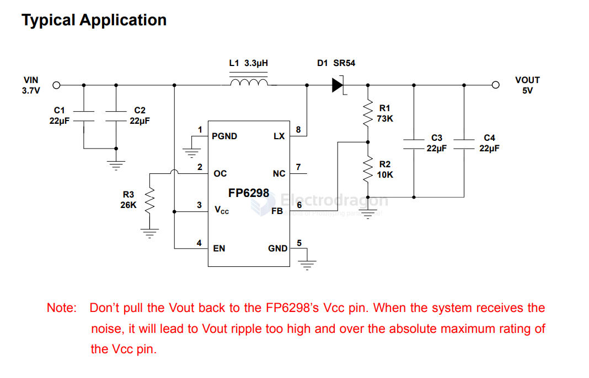

# FP6298-dat

- [[dcdc-boost-dat]]

Low-Noise 4.5A Step-Up Current Mode PWM Converter

General Description

The FP6298 is a current mode boost DC-DC converter. It is PWM circuitry with built-in 0.08Ω power MOSFET make this regulator highly power efficient. 

The internal compensation network also minimizes as much as 6 external component counts. The non-inverting input of error amplifier connects to a 0.6V precision reference voltage and internal soft-start function can reduce the inrush current.

The FP6298 is available in the SOP-8L(EP) package and provides space-saving PCB for the application fields. 

