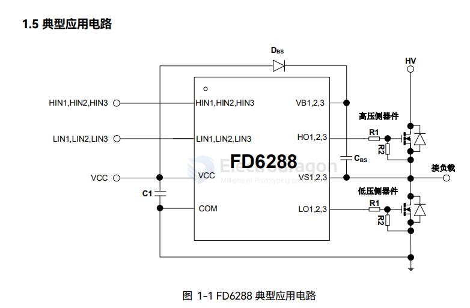

# FD6288-dat

- [[mosfet-dat]] - [[mosfet-driver-dat]] - [[FD6287-dat]] - [[fortior-dat]] - [[FD6288-dat]]

- FD6288 是一款集成了三个独立的半桥栅极驱动集成电路芯片，专为高压、高速驱动MOSFET 设计，可在高达+250V 电压下工作。
- FD6288 内置 VCC/VBS欠压（UVLO）保护功能，防止功率管在过低的电压下工作。
- FD6288 内置直通防止和死区时间，防止被驱动的高低侧 MOSFET 直通，有效保护功率器件。
- FD6288 内置输入信号滤波，防止输入噪声干扰。

## ref 

