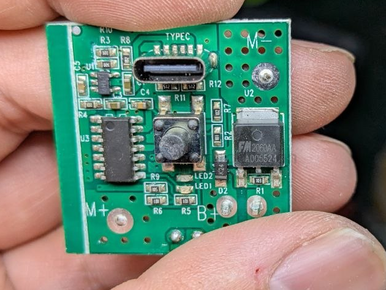

# Fuman-dat

- [[FMRX2M-dat]] - [[fuman-dat]]

- [[FM5088SS-dat]] - [[fuman-dat]] - [[battery-protector-1s-dat]]

- [[XPD318-dat]] - [[fuman-dat]]

## wireless power 

- [[fuman-dat]] - [[XPM7305-dat]] - [[power-wireless-dat]]

## mosfet 

- [[analog-device-dat]]

## battery protector

- [[battery-protector-dat]] - [[fuman-dat]] - [[DW06-dat]]

## ref 

