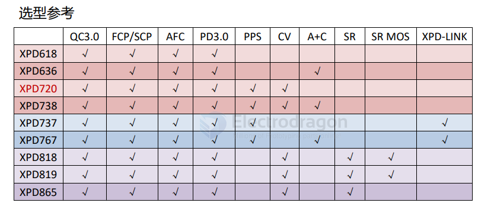
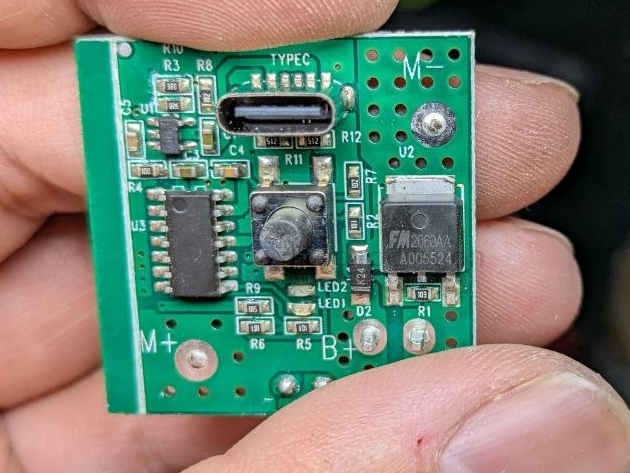

# Fuman-dat

- [[FMRX2M-dat]] - [[fuman-dat]]

- [[FM5088SS-dat]] - [[fuman-dat]] - [[battery-protector-1s-dat]]

- [[XPD318-dat]] - [[fuman-dat]]

- [[XPD636-dat]]

## XPD series 

- XPD618
- [[XPD636-dat]] - [[XPD636A.PDF]] - [[fuman-dat]]
- XPD720
- XPD738
- XPD737
- XPD740 - [[XPD740.PDF]]
- XPD767
- XPD818
- XPD819
- XPD865

XPD518、XPD618、XPD636、XPM5218、XPM5236低成本外围精简PD充电器、车充芯片方案. XPD618A/B USB Power Delivery 控制器

- XPD977 - [[XPD977-ds.pdf]]

## wireless power 

- [[fuman-dat]] - [[XPM7305-dat]] - [[power-wireless-dat]]

## mosfet 

- [[analog-device-dat]]

## battery protector

- [[battery-protector-dat]] - [[fuman-dat]] - [[DW06-dat]]

## ref 

