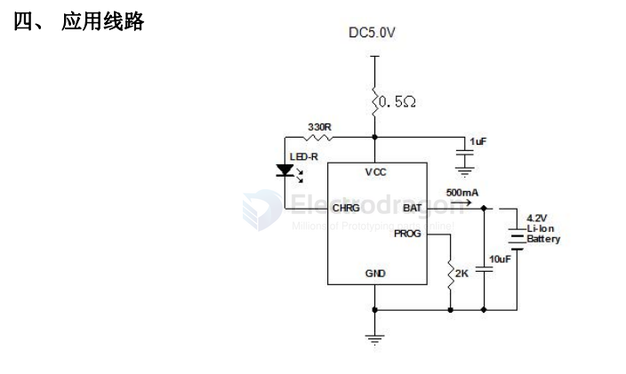

# LTH7R-dat

LTH7R - [[fuman-dat]] - [[charger-phone-dat]] - [[LTH7R-dat]] - [[humidifier-dat]]

LTH7R.是恒流/恒压座充充电器芯片，主要应用于单节锂电池充电。无需外接检测电阻，其内部为MOSFET结构，因此无需外接反向二极管。
LTH7R.在大功率和高环境温度下可以自动调节充电电流以限制芯片温度。它的充电电压固定在4.2V，充电电流可以通过外置一个电阻器进行调节。当达到浮充电压并且充电电流下降到设定电路的1/10 时，LTH7R.自动终止充电过程。当输入电压移开之后，LTH7R.自动进入低电流模式，从电池吸取少于2uA 的电流。当LTH7R.进入待机模式时，供电电流小于 25uA。
LTH7R.还可以监控充电电流，具有电压检测、自动循环充电的特性，并且具有一个指示管脚指示充电终止状态和输入电压状态。

The LTH7R is a 5-pin linear charge management integrated circuit (IC) made by Shenzhen Fuman Electronics used for single-cell 3.7V lithium-ion and lithium-polymer batteries.

## SCH 

## ref 