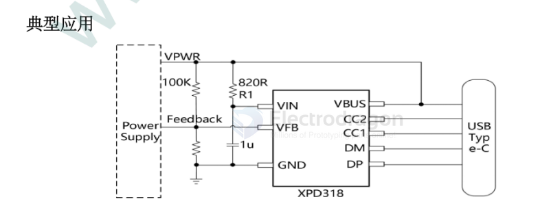

# XPD318-dat

- [[fast-charge-protocols-dat]] - [[XPD318-dat]]

USB Type-C PD Multi-protocol Controller

## Overview
XPD318 is a highly integrated USB Type-C and USB Power Delivery (PD 3.0) port controller that also supports PPS, QC3.0+/QC3.0/QC2.0, Huawei FCP/SCP, Samsung AFC, OPPO VOOC 2.0, BC1.2 DCP, and Apple 2.4A charging specifications. It provides a cost-effective USB Type-C port charging solution for AC-DC adapters, car chargers, and other devices. XPD318's built-in Type-C protocol supports automatic wake-up upon device insertion, intelligently identifies plug orientation, and establishes a connection. The integrated PD protocol supports Bi-phase Mark Coding (BMC), including hardware physical layer and protocol engine, requiring no software for encoding and decoding.

XPD318 supports up to 36W output power. The broadcast PDO voltage can be configured as 5V/9V/12V, and APDO voltage ranges of 5V Prog and 9V Prog can be configured. Through a current source that can sink/source, XPD318 connects to the feedback pin of AC-DC or DC-DC to achieve dynamic voltage regulation. It features VIN under-voltage protection, and DP/DM and CC1/CC2 over-voltage protection. XPD318 is available in a SOP8 package.

## Features
- Supports USB Type-C protocol: Configured as DFP (Source)
  - Broadcast 3A current
- Supports USB Power Delivery (PD 3.0) and PPS protocols: Integrated complete PD layered communication protocol
- PDO configurable: 5V, 9V, 12V
- Output power up to 36W
- APDO configurable: 5V Prog, 9V Prog
- Supports Quick Charge 2.0/3.0/3.0+ protocols
- Supports Huawei FCP/SCP protocols / Supports OPPO VOOC 2.0 protocol
- Supports Samsung AFC protocol
- Supports USB BC1.2 DCP / Supports Apple 2.4A charging specification
- ESD characteristic ±4KV
- Safety: Under-voltage protection / CC1/CC2/DP/DM over-voltage protection
- SOP8 package

## Applications
- AC-DC adapters
- USB charging devices

## ref 

