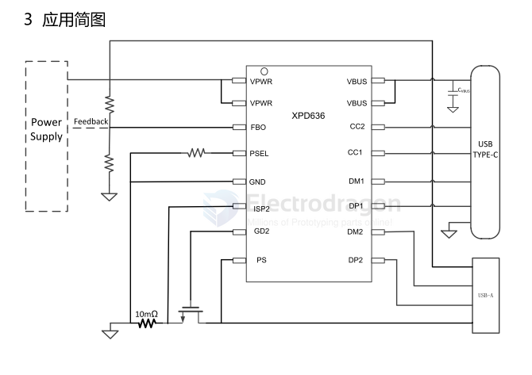
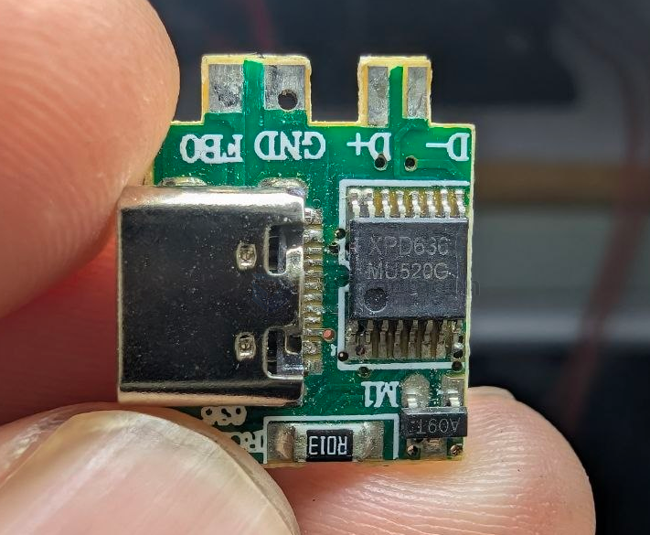

# XPD636-dat

1   特性 
  支持 USB Type -C  协议 
-  配置为 DFP（Source） 
-  广播 3A/1.5A 电流 
  支持 USB Power Delivery（PD）3.0 协议 
-  集成完整 PD3.0 分层通信协议   
- PDO：通过 PSEL 引脚选择 
  支持 Quick Charge 3.0/2.0 协议 
  支持华为 FCP/SCP 协议 
  支持三星 AFC 协议 
  支持 USB BC1.2 DCP 
  支持 Apple 2.4A 充电规范 
  集成 VBUS 通路低阻抗功率开关管 
  内置 VBUS Discharge 功能 

## SCH 

## build 

## ref 

- [[XPD636-dat]] - [[XPD636A.PDF]] - [[fuman-dat]]