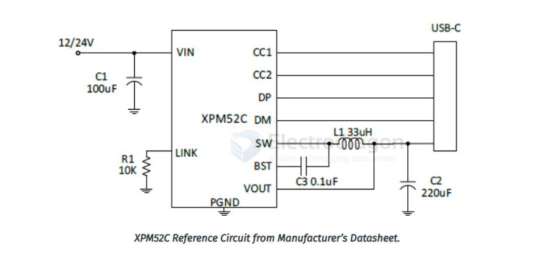
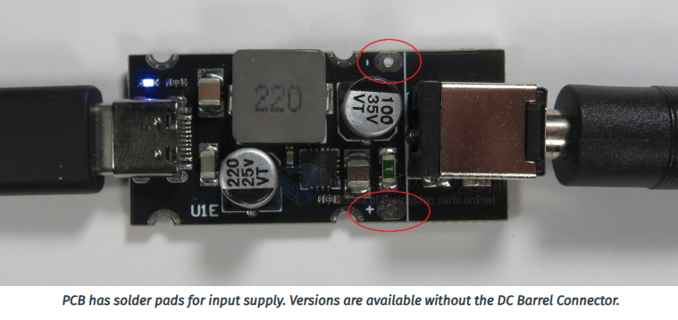
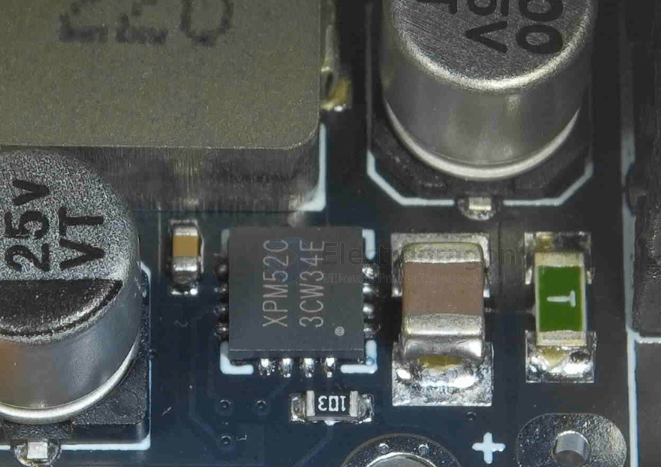
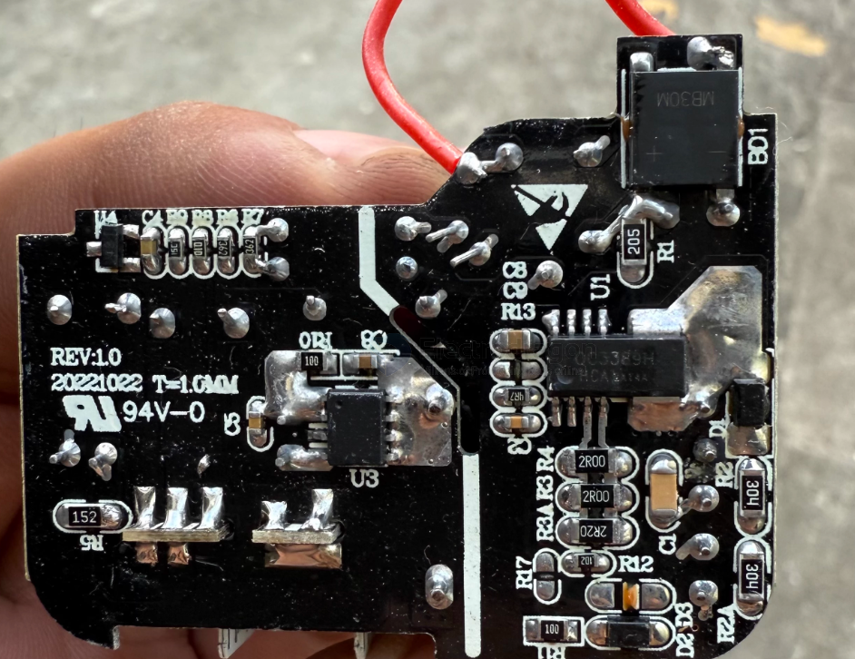
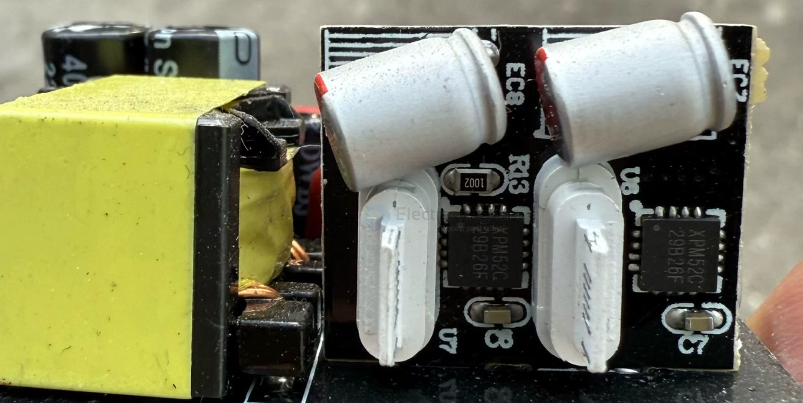

# XPM52C-dat

- datasheet == [[XPM52C-Datasheet-Chinese.pdf]]

- USB Power Delivery PD2.0/PD3.2 including PPS
- USB Battery Charging BC1.2
- Qualcomm Quick Charge QC2.0, QC3.0 & 3.0+
- Apple 2.4A Protocol (12W)
- Samsung Adaptive Fast Charging AFC
- Huawei Fast Charging Protocols FCP/SCP/HVSCP
- MediaTek PE+1.1 and PE+2.0
- Xiaomi Charge Turbo 27W

## board 1 

## board 2 

## ref 

