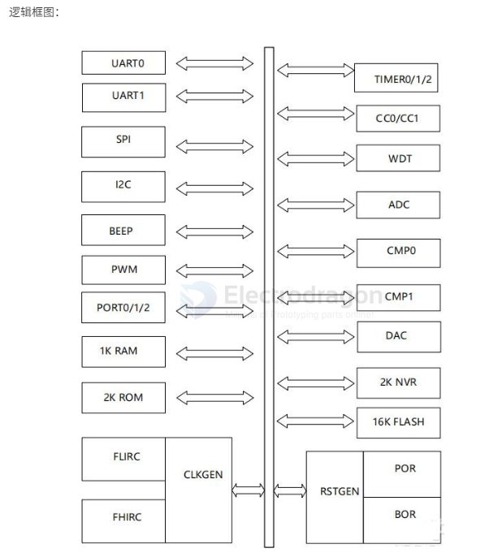
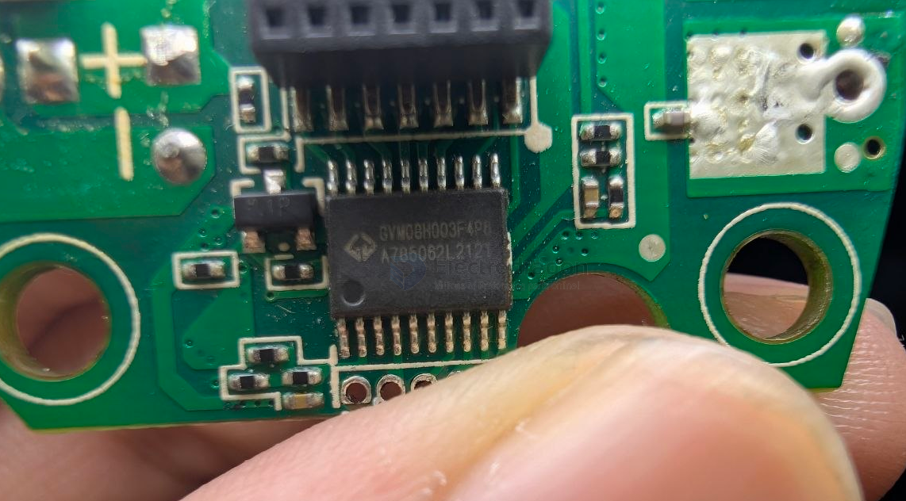

# GVM-dat

- [[MCU-dat]] - [[GVM-dat]]

- [[CMS32F033-dat]] - [[MCU-dat]] - [[GVM-dat]] - [[cmsemicon-dat]]

GVM08H003F4P6

GVM08x003是针对高速IO应用的8位宽电压MCU，其内建高速SPI模块，高速I2C模块，用于低成本高性能的通信处理场合。

特点：
1.高性能8Bit内核
8Bit1T增强型51内核，指令代码兼容标准51
工作频率最高64MHz
外设模块时钟为单独门控时钟，用户可以选择性关闭模块时钟以降低动态功耗；同时每个功能模块可以单独在ROM配置使能信号
支持共13个中断发生源，4级中断优先级控制。

2.存储器
片上集成256 BytesS RAM作为内部数据存储区
片上集成1K BytesXS RAM作为扩展数据存储区，同时也可以作为程序运行。
片上集成最大16K Bytes FLASH作为程序存储区
片上集成2K Bytes NVR（非易失性寄存器）
片上集成2K Bytes ROM，作为芯片的BootLoader和自检测（启动引导区）

3.多时钟源头，有4组clock可选择
外部时钟CLKIN/XTAL，最高支持24MHz时钟输入
内部低速FLIRC
内部高速FHIRC
内部FHIRC分频(默认4分频)，32档可配

4.工作模式
宽工作电压2.7V~4.25V
工作温度-40℃~85℃
4种工作模式，NORMAL模式、IDLE模式、STOP模式和DPD模式
DPD模式静态功耗低至0.5uA，可以IO唤醒并复位

规格差异
GVM08x003根据系统时钟频率和功耗不同，分为GVM08F003（基础型）、GVM08L003（低功耗型）、GVM08H003（高性能型）,主要差异见下表：
差异	GVM08F003	GVM08L003	GVM08H003
系统最高频率(FHIRC)	40. 55MHz	40. 55MHz	64MHz
内部低速振荡器频率(FLIRC)	128kHz	128kHz	128kHz
DPD电流	5uA	0. 5uA	0. 5uA

寄存器分布
GVM08x003特殊功能寄存器由3部分组成：CPU专用寄存器、扩展控制寄存器和二级解码寄存器组成，详见下表。特殊功能寄存器地址为0x80H~0xFFH，和内部数据存储器地址重叠，访问特殊功能寄存器用直接地址寻址，访问内部数据存储器用间接地址寻址。访问未定义区域将得到不可预测结果。

## build 

- [[MCU-dat]] - [[GVM-dat]] - [[LK513-dat]]

## ref 