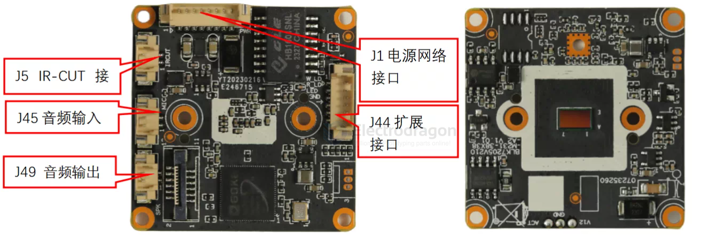

# GK7205V210-dat

- [[goke-dat]] - [[GK7205V210-dat]] - [[camera-IP-dat]] - [[openIPC-dat]]

- [[wifi-USB-dat]] - [[Wifi-SDIO-dat]] - [[wifi-dat]]

## pin out 

- 1IR-CUTIR-CUT驱动
- 2IR-CUTIR-CUT驱动
- 1W_LED_GPI00_4软白光
- 2R_LED_GP102_0软红光
- 3LED/GPI06_5LED控制脚
- 4GNDGND
- 5IRINIRIN
- 6I0/GPI06_4预留10
- 1ETH_LINK_ACT_LED网络灯
- 2ETH_LINK_STA_LED网络灯
- 3ETHTX+网口数据发送
- 4ETHTX-网口数据发送
- 5ETHRX+网口数据接收
- 6ETHRX-网口数据接收
- 7GNDGND
- 812V 输入12V 输入
- 1MICN
- 2AC_IN音频输入
- 1SPKN
- 2SPKP音频输出

- [[wifi-SDIO-dat]] for J3 

## openIPC 

https://openipc.org/cameras/vendors/goke/socs/gk7205v210

- [[uboot-dat]] - [[openIPC-dat]]

## ref 

