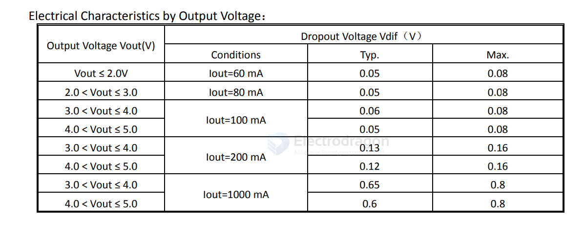

# H&MSemi-dat

[H&M Semi Website](https://www.hmsemi.com)

## HM6245 

HM6245 == [[HM6245.pdf]]

### Features
- Low voltage drop: 0.06V@100mA
- High input voltage: 8.5V
- Low temperature coefficient
- Low Quiescent Current: 2uA at 5.0V
- Output voltage accuracy: tolerance ±2%

The HM6245 series is a group of positive voltage output, three-pin regulators, that provide a high current even when the input/output voltage differential is small. Low power consumption and high accuracy is achieved through CMOS and laser trimming technologies. 

### voltage drop 

0.6V for 1A output 

