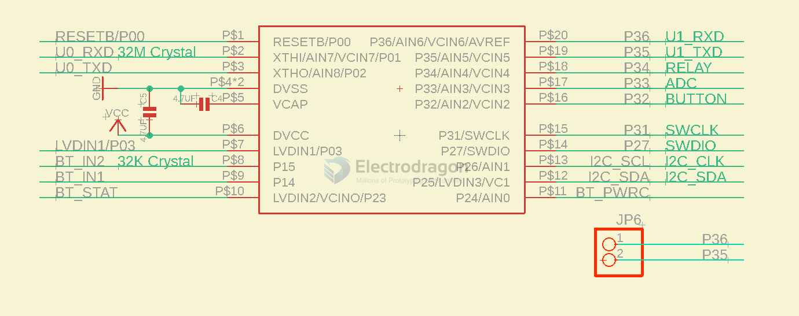

# HC32F003-dat

## Applications

For [[mesh-node-dat]] - [[NBL1107-dat]]

## Demo codes 

- AT: send AT commands to [[BLE-dat]] module [[NBL1101-dat]]
- [[I2C-dat]]: I2C data write and read 
- [[GPIO-dat]]: read write GPIO relay 