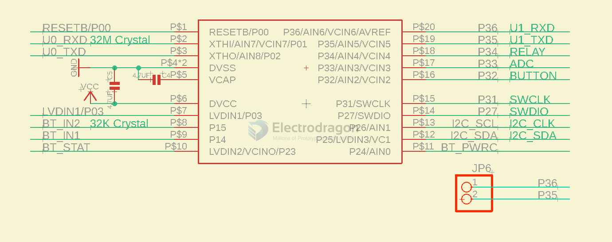

# HC32F003-dat

## Features 

### Low power

-   **5μA @ 3V Deep Sleep Mode:** Power consumption when all clocks are off, power-on reset is active, I/O state is maintained, I/O interrupts are active, and all registers, RAM, and CPU data are saved.
-   **10μA @ 32kHz Low-Speed Active Mode:** CPU and peripheral modules are running, executing program from Flash.
-   **30μA/MHz @ 3V @ 16MHz Sleep Mode:** CPU is stopped, peripheral modules are running, main clock is running.
-   **150μA/MHz @ 3V @ 16MHz Active Mode:** CPU and peripheral modules are running, executing program from Flash.
-   **3μS Low-Power Wake-up Time:** Enables more flexible and efficient mode switching, and more responsive system operation.
-   The above characteristics are typical values at room temperature. For specific electrical and power consumption characteristics, refer to the electrical characteristics chapter.

## Specs

-   **Number of General Purpose I/O Pins (GPIO):** 16
-   **CPU Core:** Cortex M0+
-   **Frequency:** 32MHz
-   **Power Supply Voltage Range:** 1.8 ~ 5.5V
-   **Single/Dual Power Supply:** Single Power Supply
-   **Temperature Range:** -40 ~ 85℃

## Applications

For [[mesh-node-dat]] - [[NBL1107-dat]]

## Demo codes 

- AT: send AT commands to [[BLE-dat]] module [[NBL1101-dat]]
- [[I2C-dat]]: I2C data write and read 
- [[GPIO-dat]]: read write GPIO relay 

## repo 

- https://github.com/Edragon/MCU-HDSC-basic
- https://github.com/Edragon/MCU-HDSC-SDK
- https://github.com/Edragon/MCU-HDSC-HC32L110
- https://github.com/Edragon/MCU-HDSC-HC32F00X
- https://github.com/Edragon/MCU-HDSC-SDK-HC32L136
- https://github.com/Edragon/MCU-HDSC-APP
- E:\Git-category\git-MCU-HDSC

## ref 

- [[HDSC-SDK-dat]]