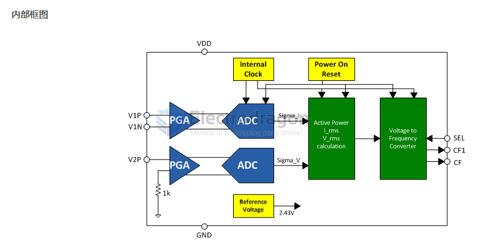
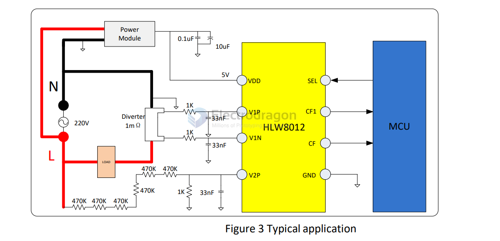
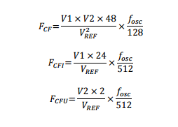

# HLW8012-dat 

- [legacy wiki page ](https://w.electrodragon.com/w/HLW8012)

## Chip Info 

### Hardware Design Note
* Board AC Mains is be NOT isolated.
* Better use optical-coupler to send isolated signal to your MCU. 
* MCU better use seperated power supply to HLW8012.

#### other note 
* Built-in crystal, 2.43V voltage reference source and power monitoring circuit
* 5V single power supply, operating current less than 3mA

## Application 

As shown in Figure 3, the power supply the HLW8012 should be in parallel with two small capacitors to filter out the noise from the grid. 

- The signal of current channel is provided by the current diverter.
- The signal of voltage channel is provided by the resistor network. 

CF, CF1, SEL connect to the input port of the MCU. MCU measure the pulse periods of CF and CF1, then calculate the active power, current RMS and voltageRMS

#### Sample resistor 

* Sample Resistor is 0.002R, 2mR (diameter 2.5mm, rate current is 20A. space is 10mm, height 7.5mm, "door" shape).

## Calculatoin 

    F_cf  = (V1xV2x48)/(V_ref)^2 x (F_osc/128)
    F_cf1 = (V1x24)/(V_ref)      x (F_osc/512)
    F_cfu = (V2x2)/V_ref         x (F_osc/512)

Note 

* Fcf = Power, Fcf1 = current, Fcfu = voltage
* V1: Voltage signal on the current channel pin
* V2: Voltage signal on voltage channel pin
* Fosc: built-in crystal, the typical frequency of about 3.579MHz;
* Vref: built-in reference source, the typical voltage is 2.43V

## Use with ESP8266

* The demo code will monitoring the power, current, voltage and frequency, you can monitor it via telnet to see remote debug output, same as serial output, but safe when AC main power connected. 
* Pin definition to esp8266 please see the comments in sketch
* Also can calibrate the parameters, see the comments in sketch
* Enter SSID and password in the sketch, run the demo code first to see IP address
* Connect to AC main power, login remotely via telnet, in windows for example, command: telnet 192.168.0.100

* [Demo code here](https://github.com/Edragon/esp8266_arduino/tree/master/HLW8012/remote_debug)

## Establishing a Clean Ground for HLW8012 Power Meter IC

To ensure accurate performance of the HLW8012 power meter IC in current shunt measurement, voltage measurement, analog (oversampling ADC) operations, and digital output interfaces, it is recommended to implement the following grounding strategy on the PCB:

1. **Create a Ground Region**: Design a ground area beneath the IC that loops around the four analog pins on the left side. This ground encirclement should be formed using a 0.5-centimeter-wide copper trace.

2. **Connect Key Components to the Ground Encirclement**:
   - The IC's ground pin.
   - The ground ends of the 0.033 µF capacitors associated with the current shunt. Ensure these PCB traces are symmetrical, balanced, and as short as possible.
   - The two capacitors used for the +5V VDD bypass filter.

Additionally, some reference designs suggest inserting a 10-ohm resistor in the path from the +5V voltage regulator to these two capacitors and the IC's VDD pin. This configuration creates a low-pass filter that reduces EMI/RFI interference entering the IC, thereby preventing miscounts or unintended power-on resets. In professional designs requiring high robustness, circuits must withstand significant electric and magnetic fields from high-power transmitters and antennas without errors. Place the 10-ohm resistor close to the two capacitors to minimize potential antenna effects.

By implementing this grounding approach, the HLW8012 IC can achieve precise and reliable power measurement.

## Demo 

https://www.youtube.com/watch?v=0aiuwRB8Uic

## DS

- [[HLW8012-HLW-REV1.3.pdf]]

## ref 

- [[HLW8012-dat]] - [[HLW8032-dat]] - [[HLW-dat]] - [[ac-mains-dat]] - [[power-meter-dat]] - [[power-sensor-dat]]

Boards - [[OPM1126-dat]]

- [[OPM1126]] - [[HLW8012]]

