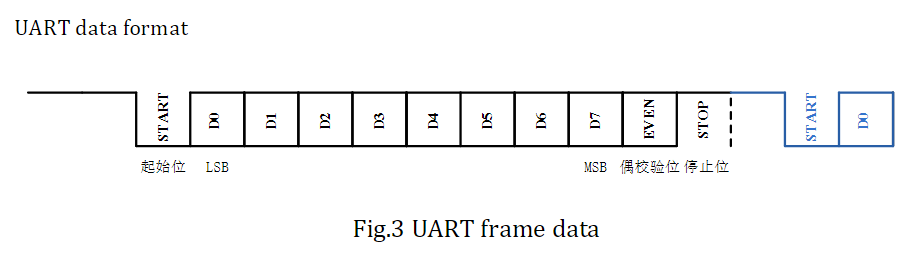
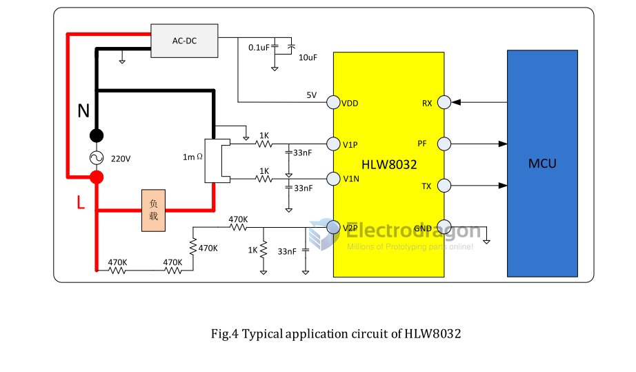
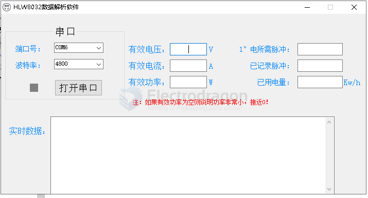
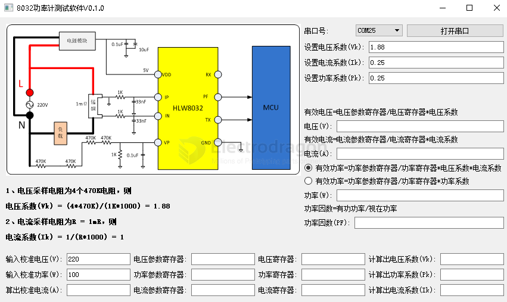
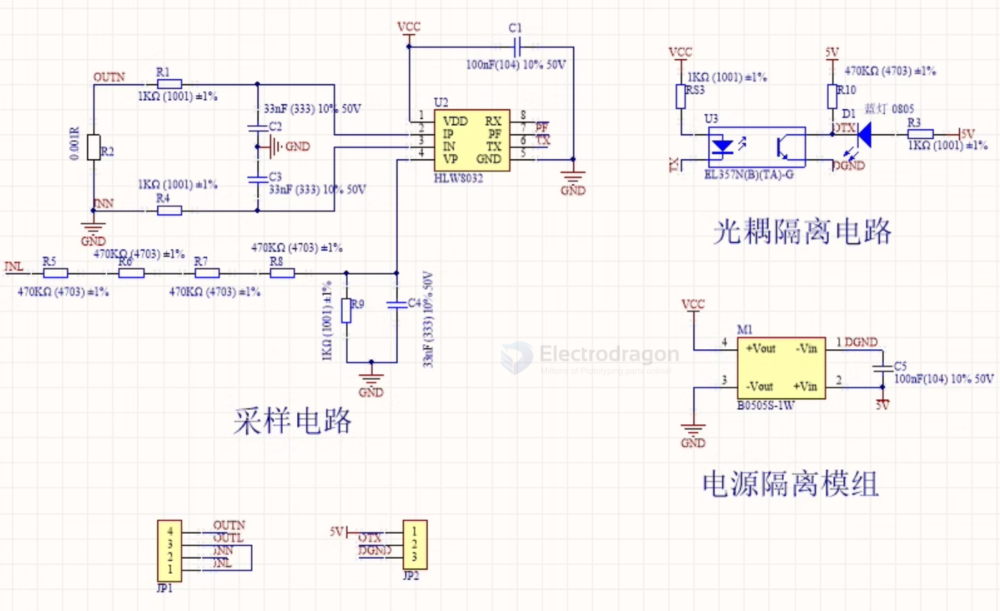

# HLW8032 DAT

[[python-dat]] serial demo code refer to page - [[HLW8032-reg-dat]]

- [[HLW8032-faq-dat]] 

[legacy wiki page.](https://www.electrodragon.com/w/Energy_meter) 

## tech 

- [[ZMCT103-dat]] == 1000:1 [[current-dat]] - [[current-transformer-dat]]
  
- [[ZMPT107-dat]] == 1000:1000 [[voltage-dat]] - [[ac-voltage-transformer-dat]] 

## boards 

- [[SVC1035-dat]] - [[SVC1038-dat]] - [[HLW8032-ISO-Version-dat]] - [[SVC1042-dat]]

- basic isolated version [[SVC1031-dat]]

- [[ACDC-dat]] integrated [[SVC1041-dat]]

retired version  - [[SVC1045-dat]]

- [[HLW8012-dat]]

## Chip Info

- The HLW8032 is a high precision energy metering IC that uses a CMOS manufacturing process and is primarily intended for single phase applications. It can measure line voltage and current, and can calculate active power, apparent power and power factor.
- The device integrates two ∑-Δ ADCs and a high-precision energy metering core. The HLW8032 can communicate data through the UART port. The HLW8032 uses a 5V supply, a built-in 3.579M crystal, and an 8PIN SOP package.
- The HLW8032 has the advantages of high precision, low power consumption, high reliability and strong adaptability to the environment. It is suitable for energy metering of single-phase two-wire power users.

## UART communication interface

HLW8032 has a simple UART interface and adopts asynchronous serial communication mode, which allows data communication via two one -way pins. The UART interface can realize isolated communication by only a low-cost photoelectric coupler. The UART interface operates at fixed frequency of 4800 bps and its interval for transmitting data is 50mS, which is suitable for design of low velocity.   

UART of HLW8032 uses two pins. The TX pin is used to transmit data from HLW8032, and data is transmitted in the least significant bit (LSB) with priority. The RX pin is used to receive the data from microcontroller. 

Data format of HLW8032:   
 
- Baud rate:4800bps   
- Start bit+data bit (8bit) + even bit + stop bit

## Applications 

## debugging software 

## SCH 

- [[AC-isolation-dat]]

- [[HLW8032-ISO-Version-dat]]

## Application areas:

- Smart home appliances
- Metering sockets
- Smart WIFI sockets
- Electric vehicle charging piles
- PDU equipment
- LED lighting
- Street light control

## demo video 

- [wiring and sensing](https://youtube.com/shorts/gFZTB0sYQD8?si=YbiH0ox_tiHjacsh) == [[SVC1041-dat]]
- same video on twitter == [setup demo video](https://x.com/electro_phoenix/status/1933032154772222440)

## Demo code 

- please find them in [repo](https://github.com/Edragon/HLW)
- https://github.com/Edragon/arduino-main2/tree/main/tech/Sensor/1-Current/HLW8032
- https://github.com/Edragon/arduino-esp8266/tree/master/Sketchbook/APP/HLW
- https://github.com/Edragon/arduino-esp8266/tree/master/Libraries/HLW8032-master

## ref

- [[sample-resistor-dat]] - [[resistor-dat]] - [[Optical-Coupler-DAT]] - [[current-transformer-dat]] - [[78L05-dat]] - [[wire-2-wire-dat]] - [[ACDC-dat]] - [[AC-dat]]

- [[AC-mains-dat]] - [[AC-measurement-dat]]

- [[HLW-dat]] - [[HLW8032.pdf]] - [[HLW8012-dat]] 