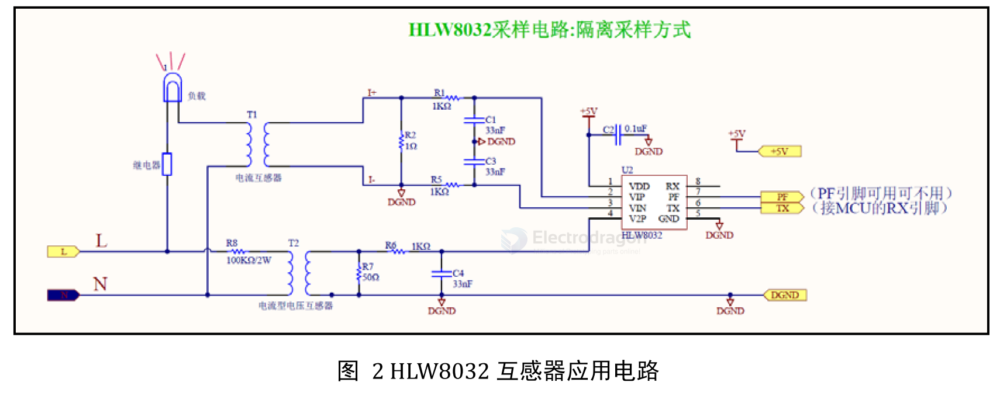

# HLW8032-ISO-Version-dat

based on [[current-transformer]] and [[ac-voltage-transformer-dat]]

- [[SVC1035-dat]] - [[SVC1038-dat]] - [[HLW8032-dat]]

Due to the adoption of a current transformer solution, the formulas in the HLW8032 datasheet cannot be used directly for calculating power, voltage, and current. However, because the power, voltage, and current of the HLW8032's input load are linearly proportional, a method of introducing scaling factors can be used. The calculation formulas are as follows:

Effective Voltage: Effective Voltage = Voltage Parameter Register / Voltage Register × K1
Effective Current: Effective Current = Current Parameter Register / Current Register × K2
Active Power: Active Power = Power Parameter Register / Power Register × K3

## Method for Obtaining K1, K2, and K3:

Apply a known load of 100W to the module, with detailed parameters P = 100W, V = 220V, I = 0.455A.

Then, the values of K1, K2, and K3 can be calculated through the following equations:

- V = 220 = Voltage Parameter Register / Voltage Register × K1 ;
- I = 0.455 = Current Parameter Register / Current Register × K2 ;
- P = 100 = Power Parameter Register / Power Register × K3 ;

Then, use the coefficients K1, K2, and K3 as constants for calculating power, voltage, and current.

| Known Value | Register Ratio                                     | Scaling Factor |
| :---------- | :------------------------------------------------- | :------------- |
| V = 220     | Voltage Parameter Register / Voltage Register      | K1             |
| I = 0.455   | Current Parameter Register / Current Register      | K2             |
| P = 100     | Power Parameter Register / Power Register          | K3             |

- [[HLW8032-reg-dat]]

## ref 

- [[zeming-dat]]

- [[HLW8032-dat]] - [[HLW-dat]]

- [[HLW8032-ISO-version]] - [[HLW]]