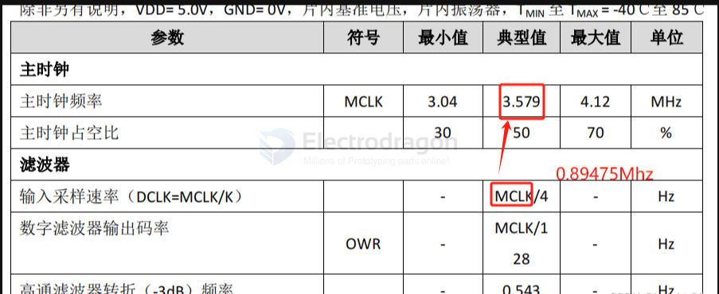

# FAQ: HLW8032 Module

## 1. What is the HLW8032 module, and what is it used for?
The HLW8032 module is designed to measure AC effective voltage, effective current, active power, and energy consumption. It can also calculate apparent power and power factor:
- **Apparent Power** = Effective Voltage × Effective Current  
- **Power Factor** = Active Power ÷ Apparent Power  

Typical applications include smart plugs and charging stations. The module outputs hexadecimal data via a serial interface, which can be processed using provided formulas. Tutorials for testing and data parsing are available.

---

## 2. Can the HLW8032 measure DC or three-phase electricity? What are its measurement ranges, sampling frequency, and accuracy?
- **DC Measurement:** Not supported.  
- **Three-Phase Electricity:** Not supported.  
- **Voltage Range:** 85V~280V AC.  
- **Current Range:** 50mA~10A/20A.  
- **Sampling Frequency:** 0.89475 MHz.  
- **Measurement Accuracy:** 2%.  

### Special Note

When measuring low-power devices (e.g., ~3W), the module updates current and power readings slowly, taking approximately 8 seconds. Similarly, it may take about 5 seconds to detect no load after a device is disconnected.

---

## 3. What sampling method does the module use? Can I connect the serial output directly to a computer?
- **Sampling Method:** Non-isolated sampling.  
- **Serial Output:** Data is isolated using an optocoupler, making the serial output pin header safe. You can connect it directly to a microcontroller or to a computer via a USB-to-TTL adapter.

---

## 4. What is the baud rate of the serial output? Can it be modified?
- **Baud Rate:** Fixed at 4800 bps.  
- **Configuration:** 8 data bits, 1 stop bit, even parity.  
- **Modification:** The baud rate cannot be changed.

---

## 5. How do I connect the module? Does it distinguish live and neutral wires? Can it work without a load or without 5V DC power?

- **AC Wiring:** Loosen the screws slightly, insert the metal part of the wire into the terminal, and tighten the screws. *(Tip: Place the module on a stable surface, hold it with one hand, and press the screwdriver down firmly while turning.)*
- **Live and Neutral Wires:** No distinction is needed.
- **Without Load:** The module can measure voltage with just a 220V input. If only 5V DC is supplied (without 220V AC input), the module will still output data.
- **5V DC Power:** Required to power the chip. Without it, the chip will not function.  
  - Do not use 3.3V as the power supply. However, the `T` pin can be connected to a 3.3V microcontroller's RXD pin.

---

## 6. What is the difference between the 10A and 20A versions? What about soldered vs. unsoldered modules?
- **10A vs. 20A Versions:** The difference lies in the sampling resistor:
  - **10A Version:** Sampling resistor is 3 milliohms.  
  - **20A Version:** Sampling resistor is 1 milliohm.  
- **Soldered vs. Unsoldered:** 
  - Soldered modules have the 3P pin header and 220V terminal pre-soldered.
  - Unsoldered modules allow for easier reinforcement of 220V traces with solder and the ability to reverse the pin header for use on other boards. Both versions are shipped with these components included.
- **Reinforcing 220V Traces:**  
  To prevent trace burnout under high current (above 10A), reinforce the 220V traces with solder on both sides of the module. Be careful not to short-circuit live and neutral wires.

---

## 7. Can the HLW8032 module connect to microcontrollers like STM32, 51, or Arduino?
Yes, the module is compatible with any TTL serial microcontroller. While example code is available for STM32 and 51 series microcontrollers, you can adapt the module to other platforms as needed. 

This FAQ should help you understand the HLW8032 module and its configuration for your application. For additional support, refer to tutorials and example projects.

## 8. Why is the effective voltage 231V instead of 220V?
This is normal and depends on the transformer and power distribution in your area. To ensure sufficient capacity, power companies often supply higher voltages. The highest observed voltage can be up to 258V. Such voltages will not damage household appliances. You can use a multimeter to verify the voltage, which should be similar to the module's readings.

---

## 9. Why does the effective current show a value when no device is connected instead of showing 0?
This is expected behavior. The module's current detection range is 50mA–10A. Although the effective current shows a value, the energy consumption does not increase. You can verify if no device is connected by checking the first byte of raw data; if it is `0xF2`, no load is connected. 

For detailed information about the meaning of each byte in the raw data, refer to the HLW8032 datasheet.

## 10. 10A or 20A ? 

The 10A and 20A ratings refer to the maximum current the module can measure. The difference between the modules lies in the current sampling resistor; everything else is the same.

- The 10A version uses a 0.003Ω (3mΩ) sampling resistor, and its current coefficient is 0.333.
- The 20A version uses a 0.001Ω (1mΩ) sampling resistor, and its current coefficient is 1.

The chip in the 20A module can actually measure currents up to 30A, but the module itself is too small to safely handle such high currents. Regardless of whether you are using the 10A or 20A version, **it is recommended to reinforce the 220V traces with additional solder.**

## ref 

- [[HLW8032-dat]]