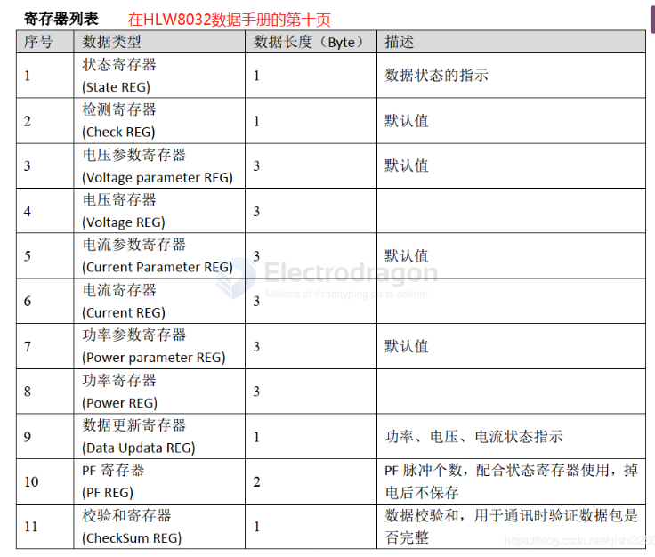
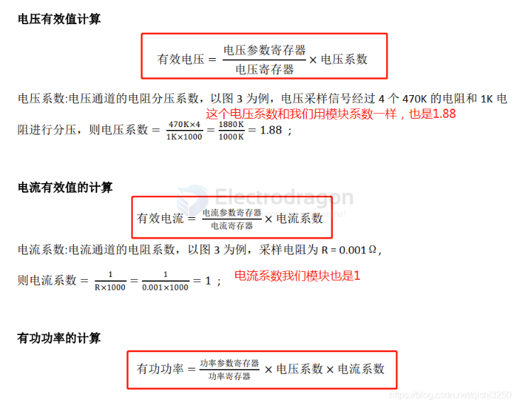
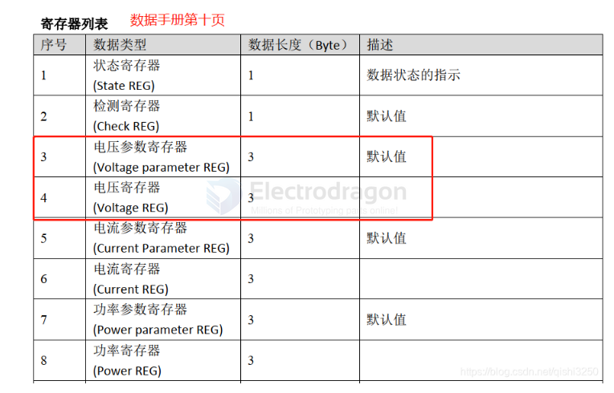
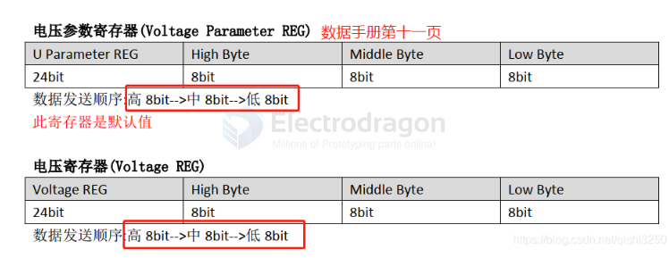
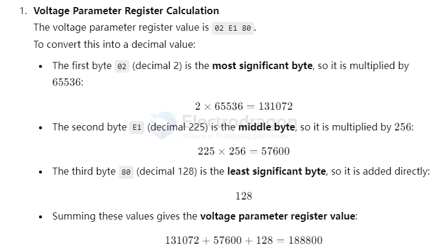
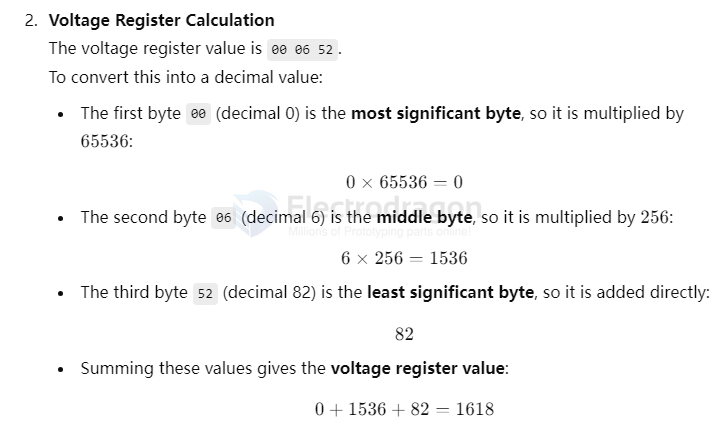
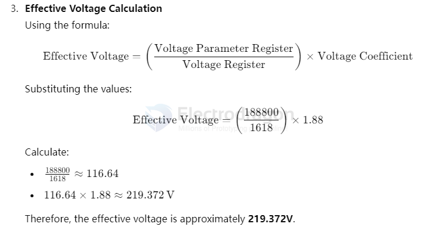

# HLW8032-reg-dat.md

## sample data 

    F2 5A 02 E1 80 00 06 52 0 3E A8 3 A6 C8 4F 9A E8 5E 79 B 61 0 1 27

### Voltage Parameter Register

    02 E1 80

Summing these values gives the voltage parameter register value: 131072 + 57600 + 128 = 188800

### Voltage Register Calculation

    00 06 52

voltage register value: 0 + 1536 + 82 = 1618

### Effective Voltage Calculation

Therefore, the effective voltage is approximately 219.372V.

## obselete 

## Hex Read

    F2 5A 02 DC D0 04 C8 20 00 3E 4E 03 7C A6 4E 2B B8 B9 8A BB 61 00 01 DC

    seperated: F2 | 5A | 02 DC D0 | 04 C8 20 | 00 3E 4E | 03 7C A6 | 4E 2B B8 | B9 8A BB | 61 | 00 01 | DC

    convert to int: 85 90 2 220 208 4 134 64 0 62 78 4 25 218 78 43 184 235 216 59 97 0 0 139

|                            | hex      | dec / int  |
| -------------------------- | -------- | ---------- |
| start                      | F2       | 242        |
| Check register             | 5A       | 90         |
| Voltage parameter register | 02 DC D0 | 2 220 208  |
| Voltage register           | 04 C8 20 | 4 134 64   |
| Current parameter register | 00 3E 4E | 0 62 78    |
| Current register           | 03 7C A6 | 3 124 166  |
| Power parameter register   | 4E 2B B8 | 78 43 184  |
| Power register             | B9 8A BB | 235 216 59 |
| Data updata register       | 61       | 97         |
| PF register                | 00 01    | 0 1        |
| CheckSum register          | DC       | 139        |

