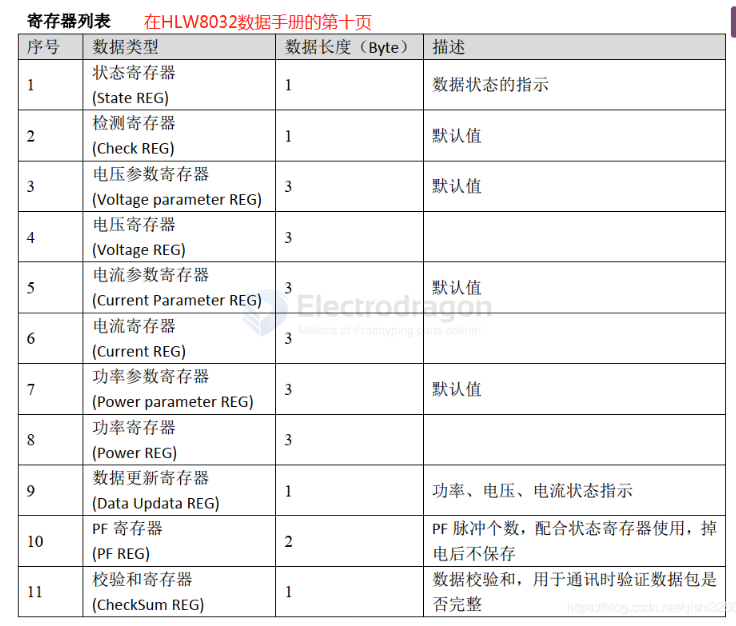
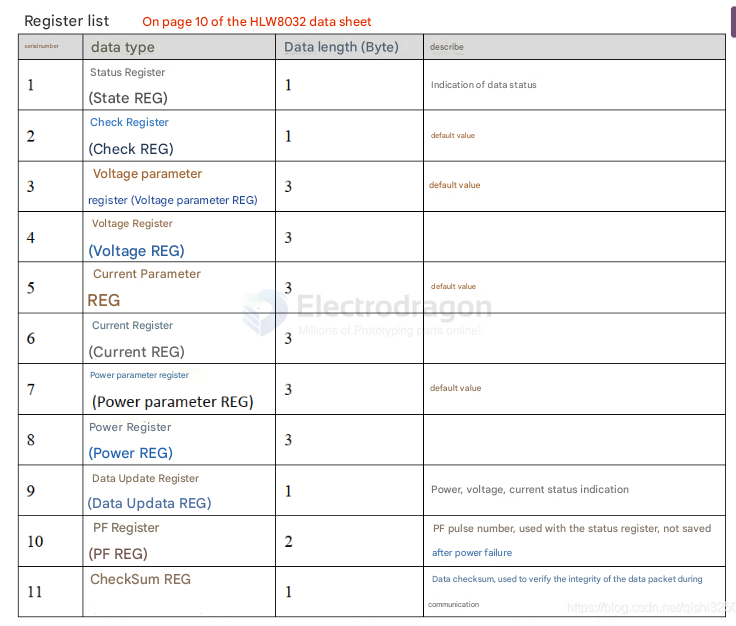
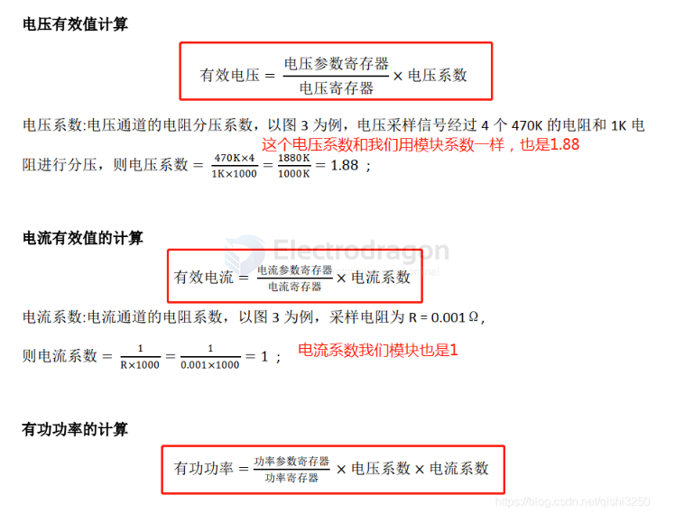
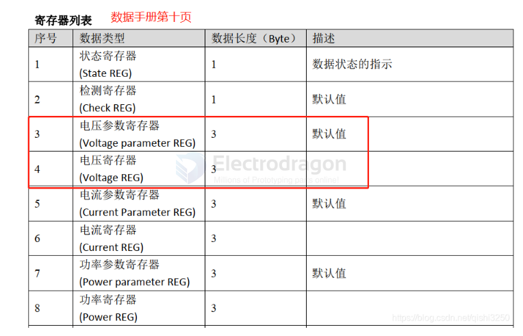
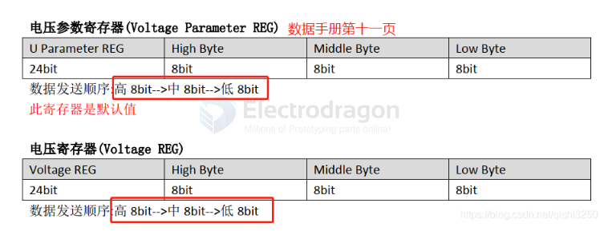
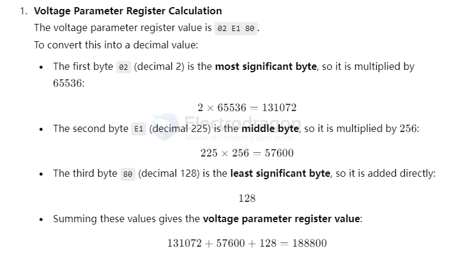
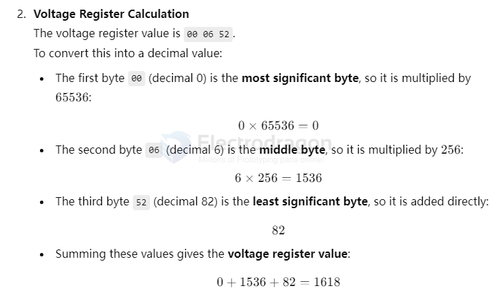
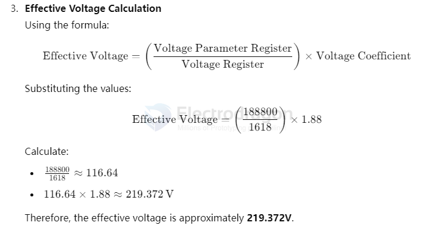

# HLW8032-reg-dat.md

[setup demo video](https://x.com/electro_phoenix/status/1933032154772222440)

- python code processing, based on [[parse_data.py]]

- Sample data, copied from serial port read [[data-SVC1041.txt]]
- some more analysis process [[HLW8032-analysis-SVC1041]]

- Sample data, copied from serial port read [[data-SVC1038.txt]]
- some more analysis process [[HLW8032-analysis-SVC1038]]

## Info Guide 

## sample data calculation for voltage 

    F2 5A 02 E1 80 00 06 52 00 3E A8 03 A6 C8 4F 9A E8 5E 79 0B 61 00 01 27

    55 5A 02 DC D0 00 05 FF 00 3C D7 00 20 51 4D E5 68 00 62 43 71 02 3C 24 

## Voltage measure Example 

**Voltage Parameter Register**

    02 E1 80 == (Dec) 188,800

Summing these values gives the voltage parameter register value: 131072 + 57600 + 128 = 188800

**Voltage Register Calculation**

    00 06 52 == (Dec) 1618

voltage register value: 0 + 1536 + 82 = 1618

Voltage Coefficient = 

    470K * 4 / 1K * 1000 = 1880K / 1000K = 1.88

**Effective Voltage Calculation**

    V_Para_Reg / V_reg * V_coefficient = 1888800 / 1618 * 1.88 = 219.372V 

Therefore, the effective voltage is approximately 219.372V.

## Current measure Example

**Note Current Coefficient factor**

- 0.001 R = 1 mR = 0.001
- 0.003 R = 3 mR = 0.003

for [[current-transformer-dat]] example 

- for 1000:1 transform ratio and on board 1R resistor, the Coefficient factor is 0.001 again 
- for 1500:1 transform ratio and on board 1R resistor, the Coefficient factor is 0.0015 
- for 2000:1 transform ratio and on board 1R resistor, the Coefficient factor is 0.002 

## obselete 

## Hex Read

    F2 5A 02 DC D0 04 C8 20 00 3E 4E 03 7C A6 4E 2B B8 B9 8A BB 61 00 01 DC

    seperated: F2 | 5A | 02 DC D0 | 04 C8 20 | 00 3E 4E | 03 7C A6 | 4E 2B B8 | B9 8A BB | 61 | 00 01 | DC

    convert to int: 242 90 2 220 208 4 134 64 0 62 78 4 25 218 78 43 184 235 216 59 97 0 0 139

|                            | hex      | dec / int  |
| -------------------------- | -------- | ---------- |
| start                      | F2       | 242        |
| Check register             | 5A       | 90         |
| Voltage parameter register | 02 DC D0 | 2 220 208  |
| Voltage register           | 04 C8 20 | 4 134 64   |
| Current parameter register | 00 3E 4E | 0 62 78    |
| Current register           | 03 7C A6 | 3 124 166  |
| Power parameter register   | 4E 2B B8 | 78 43 184  |
| Power register             | B9 8A BB | 235 216 59 |
| Data updata register       | 61       | 97         |
| PF register                | 00 01    | 0 1        |
| CheckSum register          | DC       | 139        |

read into dec from [[hex-dat]]

    unsigned long voltageParam = ((unsigned long)vpReg[0] << 16) | ((unsigned long)vpReg[1] << 8) | vpReg[2];

## demo code 

- [[hlw8032-1.ino]]

## debug 

while no input 

    55 5A 02 DC D0 07 34 0E 00 3C D7 00 F9 6C 4D E5 68 4F F4 F7 61 00 1A BE 
    55 5A 02 DC D0 07 34 0E 00 3C D7 00 F9 6C 4D E5 68 51 8D 5D 61 00 1A BF 
    55 5A 02 DC D0 07 34 0E 00 3C D7 00 F9 6C 4D E5 68 53 26 C2 61 00 1A BF 
    55 5A 02 DC D0 07 34 0E 00 3C D7 00 F9 6C 4D E5 68 54 C0 27 61 00 1A BF 

    55 5A 02 DC D0 00 06 03 00 3C D7 00 3F 71 4D E5 68 00 ED 02 71 00 FC 70 
    55 5A 02 DC D0 00 06 03 00 3C D7 00 3F 71 4D E5 68 00 ED 02 71 00 FE 72