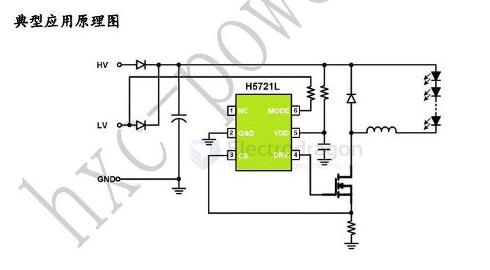

# H5721-dat.md

- [[H5721-dat]] - [[HXC-dat]] - [[led-driver-dat]]

产品描述

H5721L是一款外围电路简单，采用VFPWM连续工作模式的非隔离式恒流LED驱动芯片。H5721L典型开关频率固定为130KHz，由于采用固定PWM工作模式，因此在应用中可以采用较小值的电感，可以有效节省整机空间。H5721L可以通过对MODE端口进行控制实现两种功能切换，MODE悬空即为高亮模式，MODE接高电平即为50%负载电流的低亮模式。

H5721L采用S0T23-6L封装，可以搭配我司系列MOS器件做大电流输出的驱动器。

产品特征

支持宽压输入范围
典型的130KHz开关频率
高效率：最高可达95%以上
输出电流可高达5A(据外挂MOS散热决定)
内置智能温度保护，高温掉电流
内置5.5V稳压管
平均电流工作模式
集成输出短路保护功能

典型应用

直流或交流输入LED驱动器
RGB背光LED驱动
电动自行车照明
大功率LED照明
汽车照明等

## SCH 

## ref 