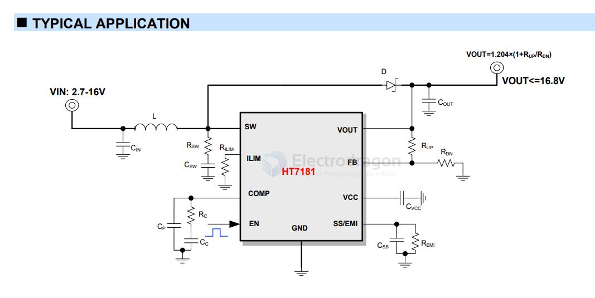

# HT7181

- Datasheet: [[HT7181-datasheet.pdf]]

- [[HT7181-dat]] - [[dcdc-boost-dat]] - [[heroic-dat]]

## Applications

- Wireless Speakers / Portable Speakers
- Power Bank, Chargers
- Power Interface (USB Type-C, Thunderbolt)
- POS Terminal
- Tablet PC / Notebook

## Features

- **Input voltage range:** 2.7V to 16V
- **Output voltage range:** up to 16.8V
- **Internal Fixed PWM frequency:** 360kHz
- **Programmable switch peak current limit:** up to 14A
- **High Efficiency:**
    - 94% ($V_{IN} = 7.2V, V_{OUT} = 9.3V, I_{OUT} = 1.5A$)
    - 90% ($V_{IN} = 7.2V, V_{OUT} = 9.3V, I_{OUT} = 7A$)
    - 93% ($V_{IN} = 7.2V, V_{OUT} = 12V, I_{OUT} = 1.5A$)
    - 90% ($V_{IN} = 7.2V, V_{OUT} = 12V, I_{OUT} = 5.5A$)
    - 90% ($V_{IN} = 3.6V, V_{OUT} = 12V, I_{OUT} = 1A$)
    - 85% ($V_{IN} = 3.6V, V_{OUT} = 12V, I_{OUT} = 2.2A$)
- **Low Power:** 1.0µA current consumption during shutdown
- **EMI Solution:** Two modes with different $t_r/t_f$
- **Soft Start:** Programmable soft start
- **Protection:** Output overvoltage protection (at 18V), thermal shutdown protection
- **Package:** Pb-free SOP8L-PP

### 16.8V, 14A Boost Converter

TheHT7181is ahigh-powerdensity,asynchronousboost converter with a 20mQ power switch to provide a high efficiencyandsmallsizesolutioninportablesystems.The HT7181 has wide input voltage range from 2.7 V to 16 V to support applications with single cell, two cell Lithium batteries and 12V lead-acid batteries. The device has 14A switchcurrentcapabilityandcanprovideanoutputvoltage up to 16.8V.

The HT7181 also implements a programmable soft-start function and an adjustable switching peak current limit function. HT7181 integrates two modes with different tr/tf to balance different requirements of EMl and efficiency. Inaddition,thedeviceprovides18Voutputovervoltage protection, and thermal shutdown protection.

## ref 

