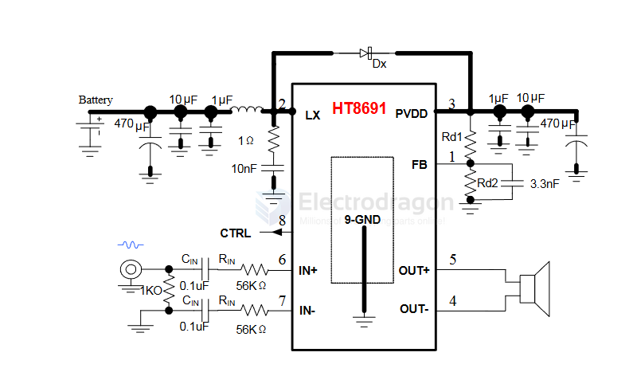

# HT8691-dat

- [[HT8691-dat]] - [[heroic-dat]] - [[amplifier-audio-dat]] - [[IP6826-dat]]

-40℃~+85℃ 0.1% 1-Channel 2.5V~5.5V 20mA 3Wx1@8Ω 74%、80% 90dB Automatic mute/no-noise switch、Enable/disable function、Filterless architecture、Configurable output topology Class AB、Class D ESOP-8 Audio Amplifiers ROHS

- datasheet == [[HT8691-datasheet.pdf]]

5.5W Anti-Clipping Mono Class D Audio Amplifier with Boost Converter

## APP 

## ref 