# HI3516-dat

- [[HI3516-dat]] - [[HiSilicon-dat]] 

- HiSilicon HI3516AV100
- HiSilicon HI3516AV200
- HiSilicon HI3516AV300

- HiSilicon HI3516CV100
- HiSilicon HI3516CV200
- HiSilicon HI3516CV300
- HiSilicon HI3516CV500

- HiSilicon HI3516DV100
- HiSilicon HI3516DV200
- HiSilicon HI3516DV300

- HiSilicon HI3516EV100
- HiSilicon HI3516EV200
- HiSilicon HI3516EV300

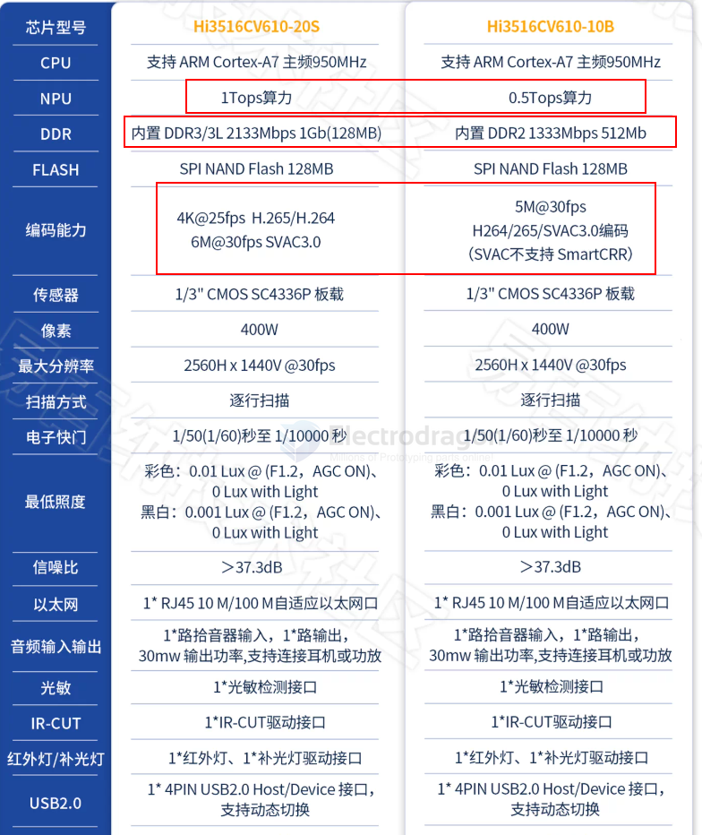

- CPU Hi3516CV610-20S
- 感光芯片 SC500AI
- 尺寸 38X38mm
- 算力 1Tops
- 内置 DDR3 1Gbit
- 最大性能 4K@20/6M@30
- 分辨率 5M
- 安装孔距 34X34mm
- CPU 时钟 950MHz
- Nand Flash 1Gbit

## images 

- [[SC500AI-dat]] - [[SC4336P-dat]] - [[sensor-camera-dat]]

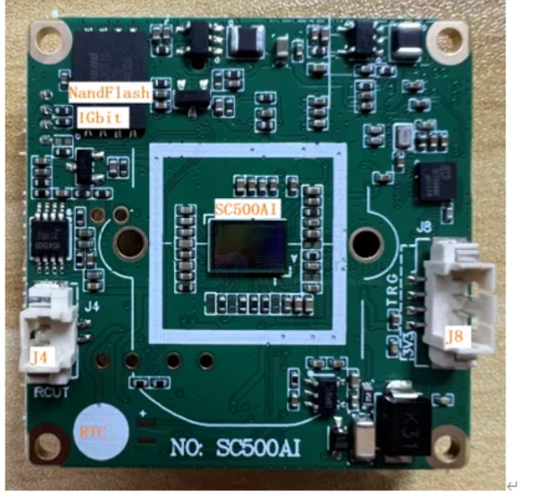

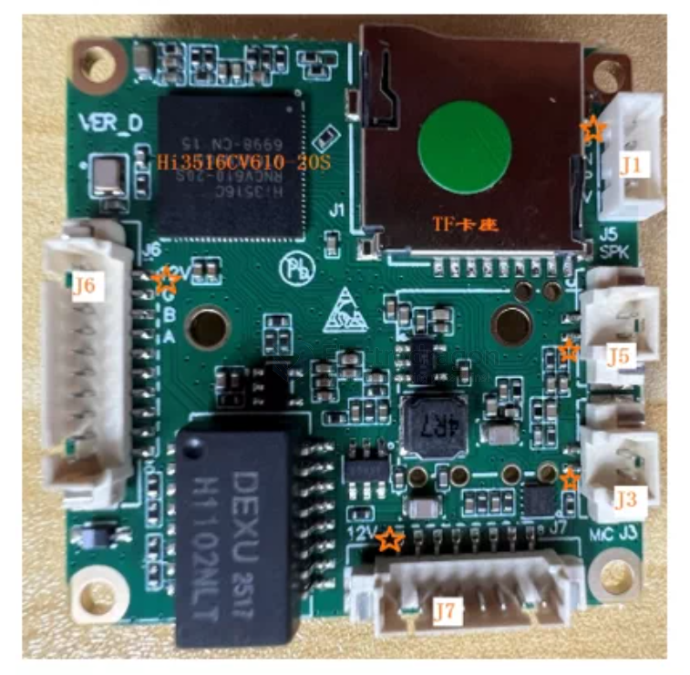

## pinout 

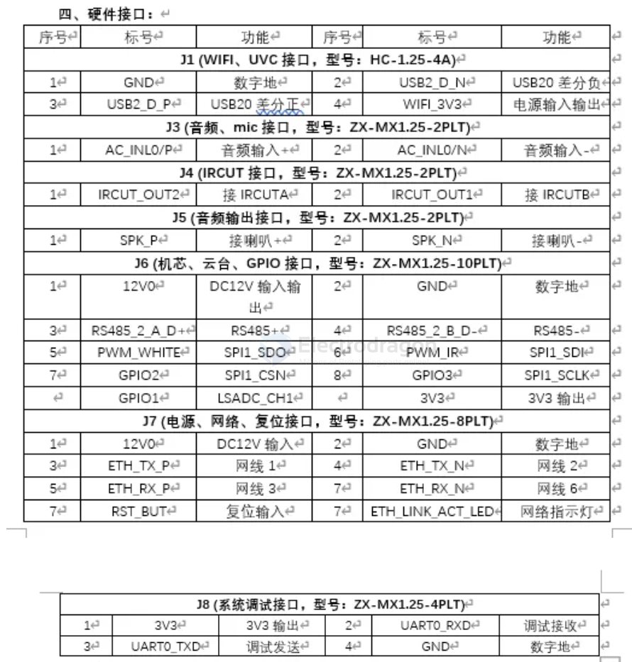

interface - [[wifi-sdio-dat]] - [[UVC-dat]] - [[wifi-USB-dat]]

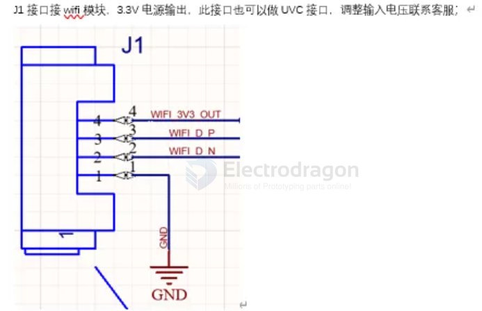

IRCUT - J2接通用IRCUT.板子里面有测试脚本；

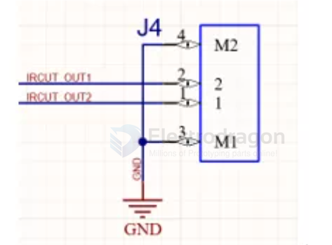

J3是音频输入.接MIC:

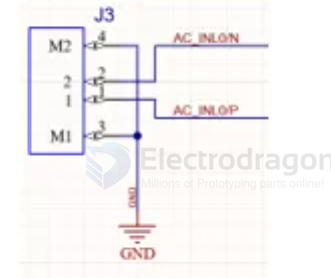

J5是音频输出，接喇叭；

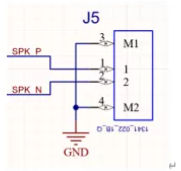

J6接RS485、SPI、ADC、GPIO等，部分复用；

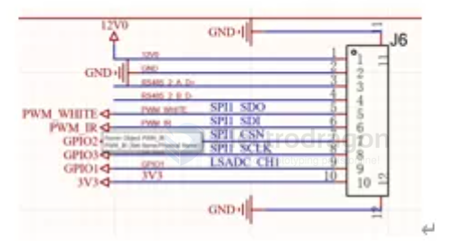

J7 DC12V电压输入、RJ45S接口、系统复位、网络指示灯；

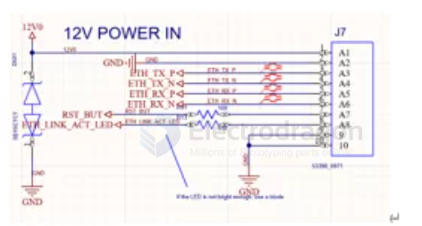

J8 系统调试接口

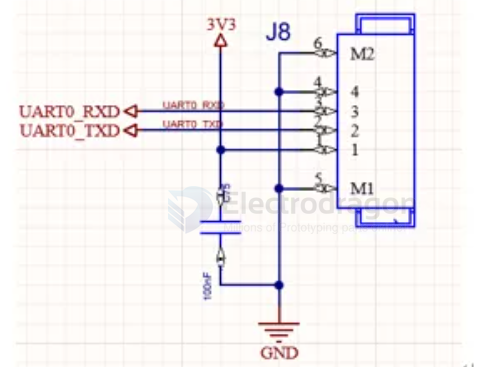

## SDK 

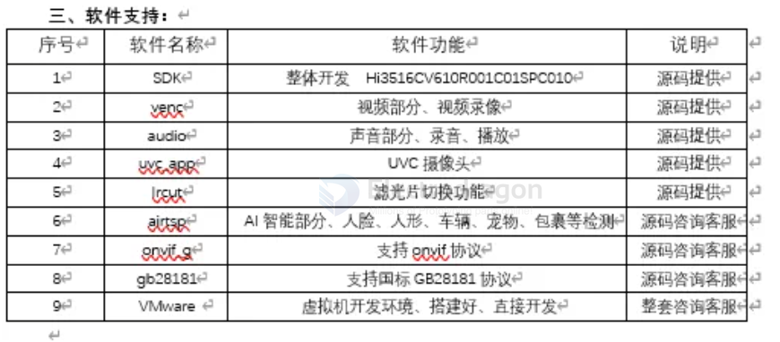

整体开发Hi3516CV610R001C01SPC010
视频部分、视频录像
声音部分、录音、播放
UVC 摄像头
滤光片切换功能
AI智能部分、人脸、人形、车辆、宠物、包裹等检测
支持eovif协议
支持国标GB28181协议
虚拟机开发环境、搭建好、直接开发

## ref 

- [[hi3516]] - [[hisilicon]] - [[chip-cn]]