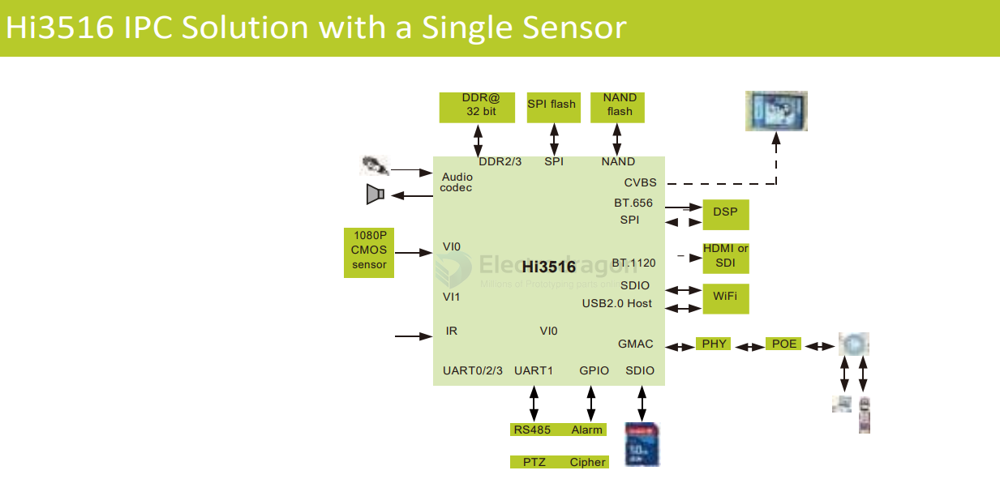
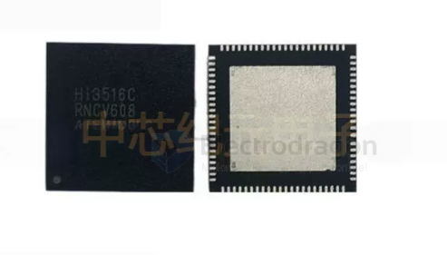
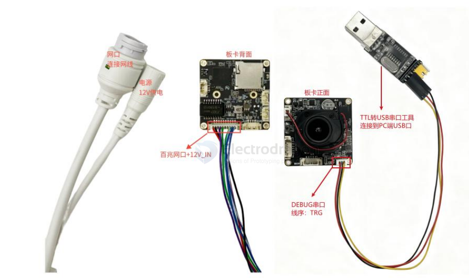
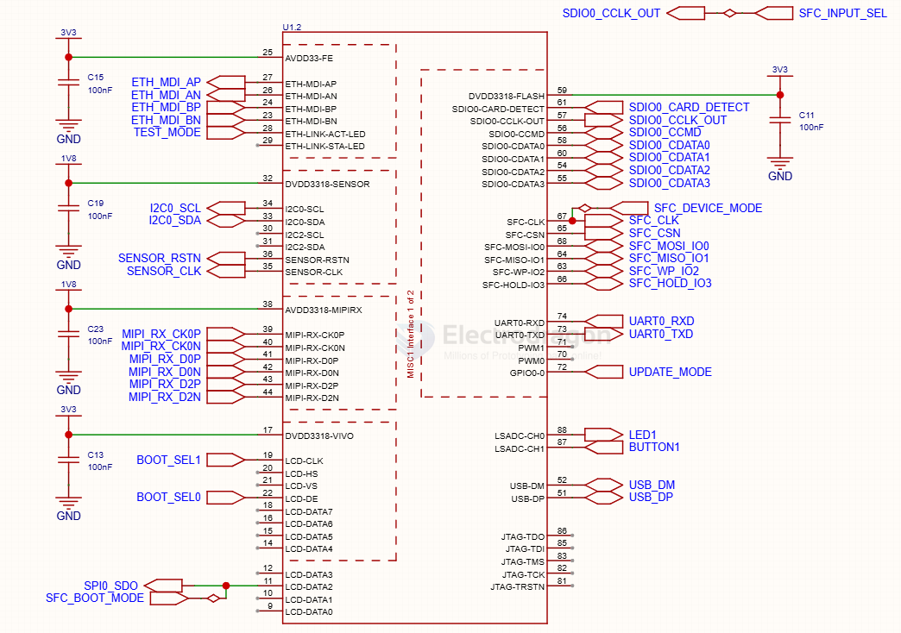
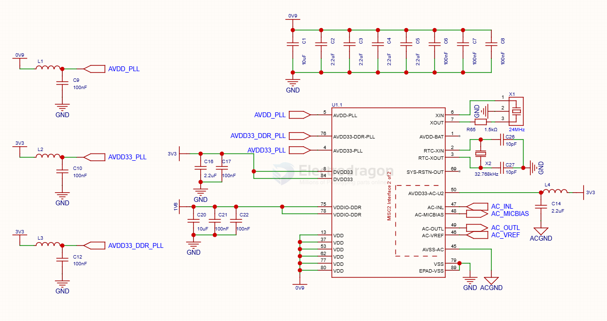
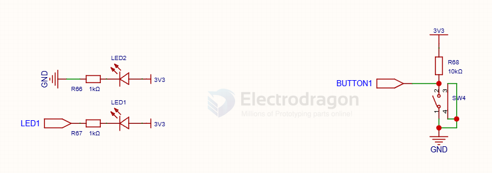
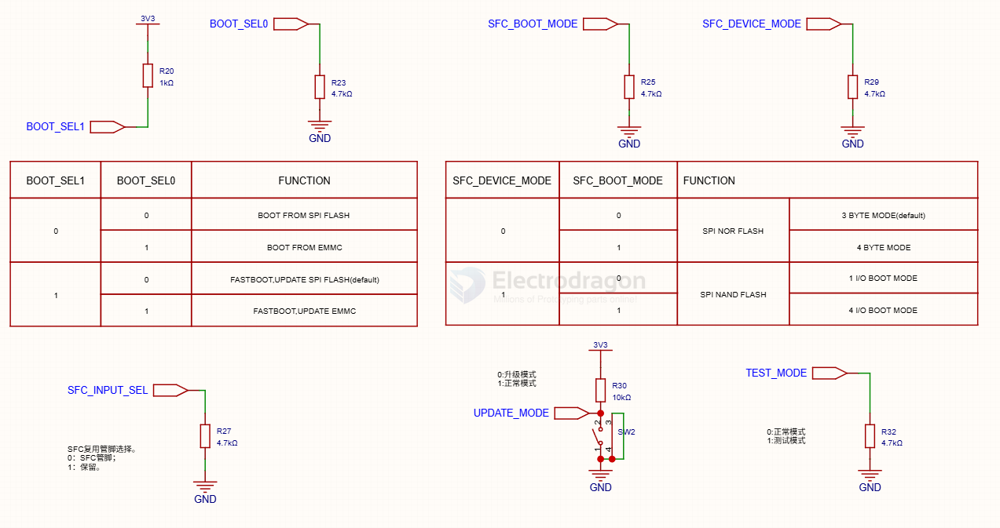

# HI3516-dat

- [[HI3516-dat]] - [[IMX307-dat]] - [[PCB-design-complex-dat]] - [[PCB-design-dat]] - [[HI3516-IMX307-dat]]

- [[hisilicon-dat]] - [[hi3516-dat]] - [[hi3518-dat]]

## tech 

- [[MIPI-dat]]

- [[IMX307-dat]] - [[MIPI-dat]] - [[HI3516-dat]] - [[CONN-FPC-dat]]

- [[DDR-dat]] - [[memory-dat]]

- Hi3516 是 BGA（0.65/0.8mm pitch） → 至少 4 层，推荐 6 层（DDR + 阻抗控制走线）

HiSilicon Hi3516 DMEB (Development Mechanism Evaluation Board)

## SDK

PCB part 

    Hi3516XXXX_SDK_Vx.x.x.x/
    └── 03.hardware/
        └── board/
            ├── HI3516XXXXDMEB_VER_C_SCH.pdf      <-- Main Schematic PDF
            ├── HI3516XXXXDMEB_VER_C_PCB.brd      <-- Allegro PCB File
            └── documents/
                └── Hi3516XXXX Hardware Design Guide.pdf

## diagram 

## chip 

Hi3516C / Hi3516D / Hi3516E series == 416-pin FC-CSP

HI3516CRNCV608

- [[HI3516-dat]] - [[PCB-design-complex-dat]] - [[IMX307-dat]]

- [[HI3516-dat]] - [[HiSilicon-dat]] 

- [[WIFI-USB-dat]] - [[WIFI-SDIO-dat]] - [[microsd-dat]] - [[SD-dat]] - [[POE-dat]] - [[RS485-dat]] - [[speaker-dat]]

- HiSilicon HI3516AV100
- HiSilicon HI3516AV200
- HiSilicon HI3516AV300

- HiSilicon HI3516CV100
- HiSilicon HI3516CV200
- HiSilicon HI3516CV300
- HiSilicon HI3516CV500

- HiSilicon HI3516DV100
- HiSilicon HI3516DV200
- HiSilicon HI3516DV300

- HiSilicon HI3516EV100
- HiSilicon HI3516EV200
- HiSilicon HI3516EV300

- CPU Hi3516CV610-20S
- 感光芯片 SC500AI
- 尺寸 38X38mm
- 算力 1Tops
- 内置 DDR3 1Gbit
- 最大性能 4K@20/6M@30
- 分辨率 5M
- 安装孔距 34X34mm
- CPU 时钟 950MHz
- Nand Flash 1Gbit

## images 

- [[SC500AI-dat]] - [[SC4336P-dat]] - [[sensor-camera-dat]]

## pinout 

interface - [[wifi-sdio-dat]] - [[UVC-dat]] - [[wifi-USB-dat]]

IRCUT - J2接通用IRCUT.板子里面有测试脚本；

J3是音频输入.接MIC:

J5是音频输出，接喇叭；

J6接RS485、SPI、ADC、GPIO等，部分复用；

J7 DC12V电压输入、RJ45S接口、系统复位、网络指示灯；

J8 系统调试接口

## SDK 

整体开发Hi3516CV610R001C01SPC010
视频部分、视频录像
声音部分、录音、播放
UVC 摄像头
滤光片切换功能
AI智能部分、人脸、人形、车辆、宠物、包裹等检测
支持eovif协议
支持国标GB28181协议
虚拟机开发环境、搭建好、直接开发

- [[vmware-dat]] - [[ubuntu-dat]] - [[openIPC-dat]] - [[SDK-dat]] - [[HiSilicon-dat]] - [[HI3516-dat]]

### debug 

### firmware update 

ToolPlatform-CAM-5.6.84-win32-x86_64。

## build 

- [[CONN-FPC-dat]] 

main 

config 1 

config 2 

- [[memory-dat]]

## ref 

- [[hi3516]] - [[hisilicon]] - [[chip-cn]]