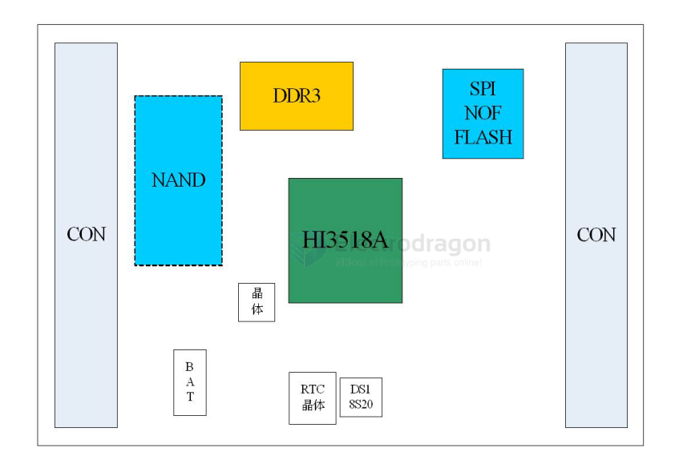
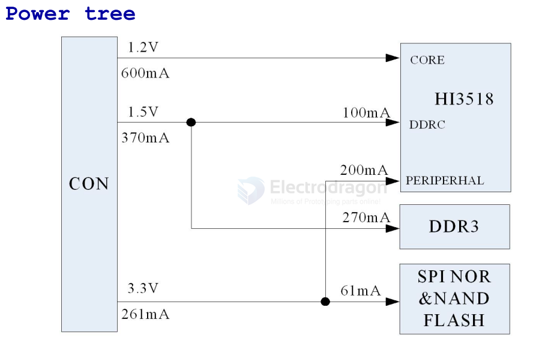
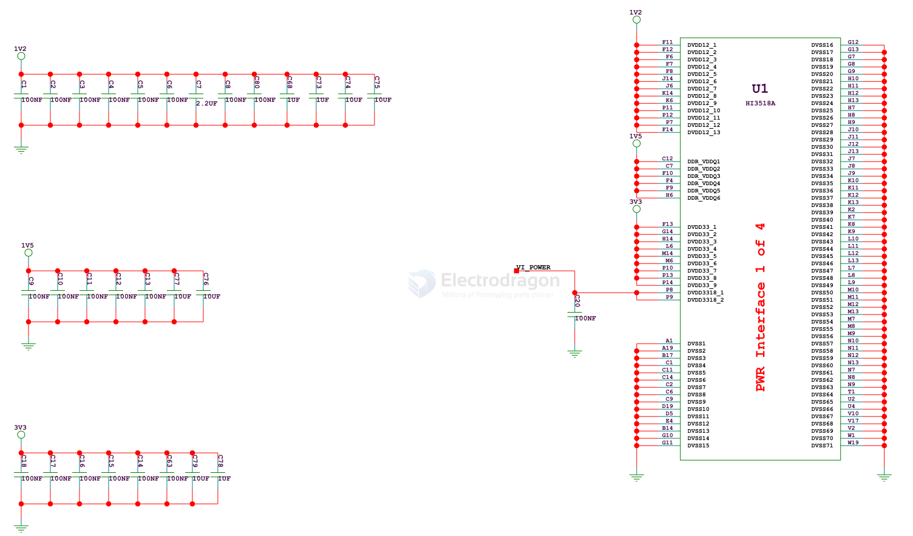
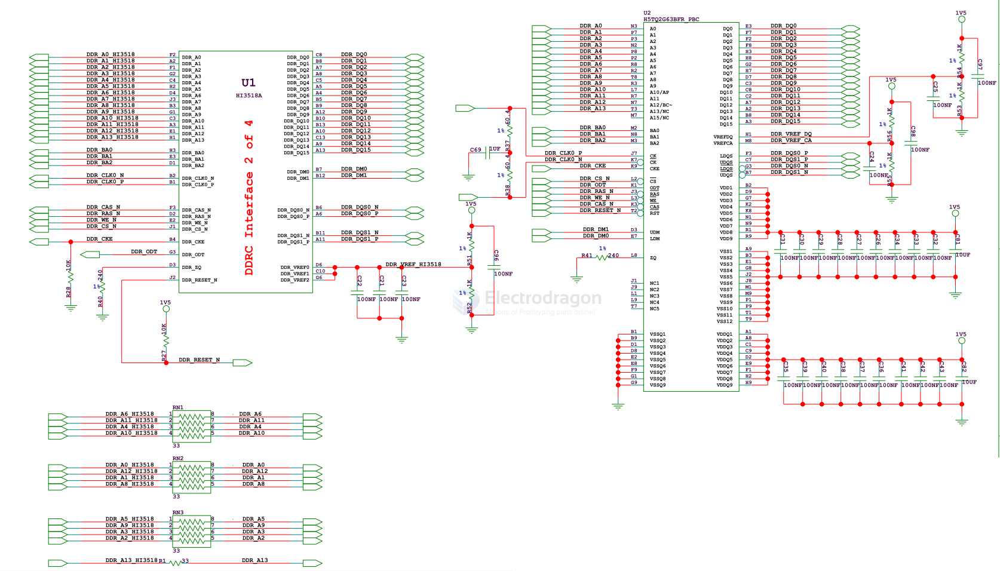
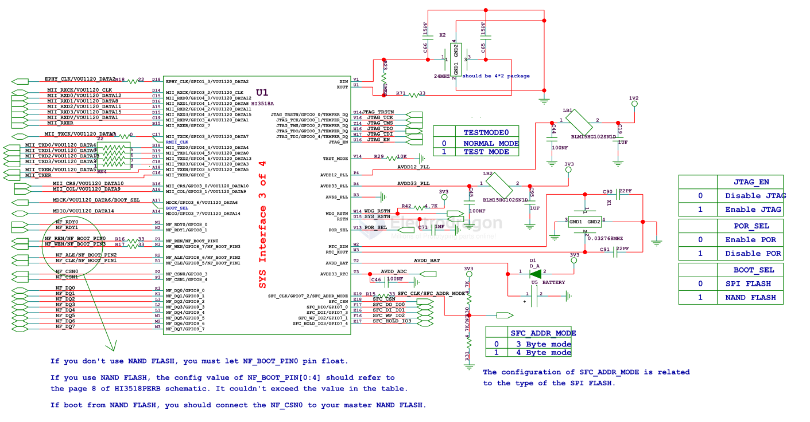
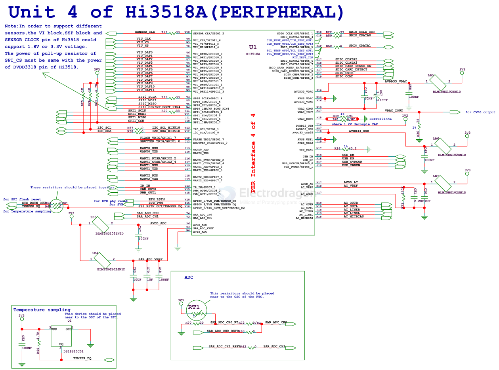
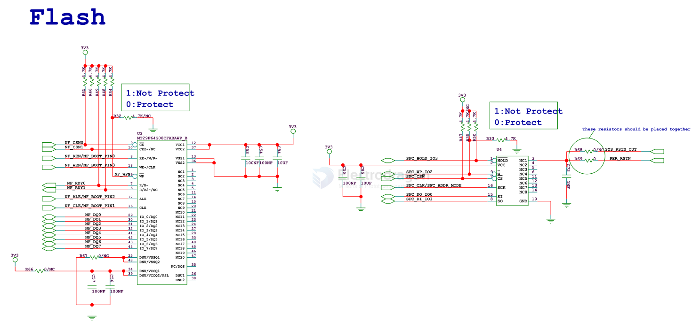
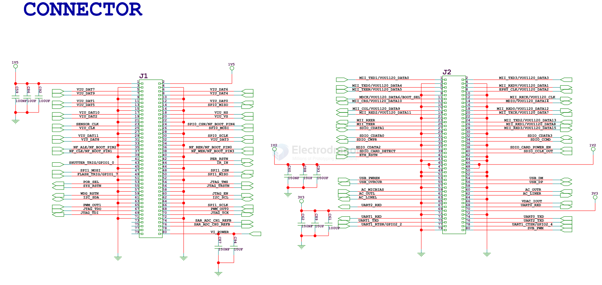

# HI3518-dat

- [[hi3516-dat]] - [[HiSilicon-dat]] - [[HI3518-dat]]

- [[AR0130-dat]] - [[onsemi-dat]] - [[HI3518-dat]] - [[hisilicon-dat]] - [[camera-IP-dat]]
- [[IMX122-dat]] - [[sony-dat]] - [[HI3518-dat]] - [[hisilicon-dat]] - [[camera-IP-dat]]
- [[OV9712-dat]] - [[OmniVision-dat]] - [[hisilicon-dat]] - [[camera-IP-dat]]

## PCB 

HI3518ADMEB_PCB.pcb == [[cadence-dat]] - [[HI3518-dat]] - [[EDA-dat]]

## diagram and sch 

- [[HI3518ADMEB_SCH.pdf]] - [[HI3518PERB_SCH.pdf]]

diagram 

power tree - [[power-dat]] - [[power-tree-dat]] - [[HI3518-dat]]

power 

DDR 

SYS

periperals

flash 

CONN

## Hi3518

Hi3518EV300

https://www.hisilicon.com/cn/products/smart-vision/consumer-camera/IOTVision/Hi3518EV300

- HiSilicon HI3518CV100
- HiSilicon HI3518EV100
- HiSilicon HI3518EV200
- HiSilicon HI3518EV201
- HiSilicon HI3518EV300
- HiSilicon HI3519V101
- HiSilicon HI3520DV100
- HiSilicon HI3520DV200
- HiSilicon HI3536CV100
- HiSilicon HI3536DV100

## ref 

