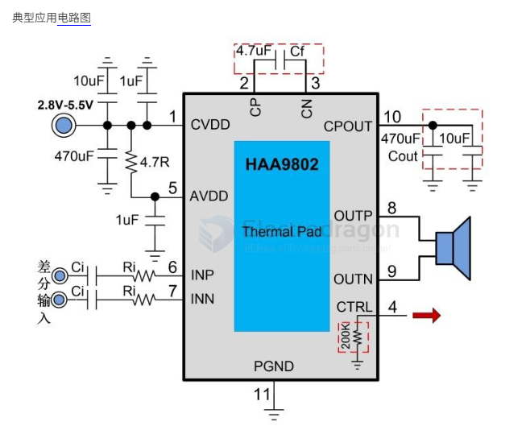
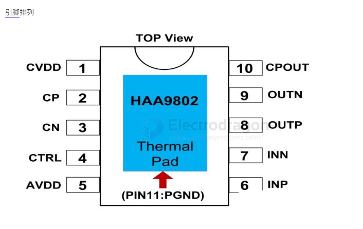

# Hynitron-dat

- [[HAA9802-dat]] - [[Hynitron-dat]]

- [[jieli-dat]]

The HAA9802 is a mono audio power amplifier featuring a capacitive boost, anti-clipping function, and switchable Class AB/D operation. it can deliver up to 5.4W of continuous output power into a 4Ω load. The HAA9802 features a unique built-in anti-clipping function that automatically adjusts the gain according to the output signal level to prevent clipping distortion and ensure a more comfortable listening experience. Additionally, it includes an adaptive boost function: at low signal levels, the charge pump remains in bypass mode to minimize power consumption and maximize efficiency; at higher signal levels requiring greater dynamic range, the charge pump is activated to boost the voltage, achieving a perfect balance between efficiency and output power. Its fully differential input architecture and high PSRR effectively enhance its immunity to RF noise. The HAA9802 also boasts an extremely low shutdown current, significantly extending system standby time. Reliability is bolstered by OCP, OTP, and UVLO protection features. The POP-click suppression function further improves the auditory experience while simplifying system tuning.

## Features
● Class AB/D switching function
● 4 selectable anti-clipping (AGC) modes
● Adaptive boost function, Charge pump boosts to 6.6V
● Class D output power:
  - 5.4W (VDD=4.5V, RL=4Ω, NCN OFF, THD+N=10%)
  - 5.2W (VDD=4.2V, RL=4Ω, NCN OFF, THD+N=10%)
● Class AB output power:
  - 2W (VDD=4.2V, RL=4Ω, Boost OFF, THD+N=10%)
● Operating voltage: 2.8V to 5.5V
● Low distortion and low noise
● POP-click suppression function
● Shutdown current (<1uA)
● OCP, OTP, UVLO protection features

## Applications
● Megaphones
● Portable speakers / Card speakers
● Bluetooth speakers / AI speakers

## Absolute Maximum Ratings
| Parameter | Description | Value | Unit |
| :--- | :--- | :--- | :--- |
| VDD | Supply voltage (no signal) | 7.5 | V |
| VI | Input voltage | -0.3 to VDD+0.3 | V |
| TA | Operating temperature | -40 to 85 | °C |
| Tj | Junction temperature | -40 to 150 | °C |
| Tstg | Storage temperature | -65 to 150 | °C |
| Tsld | Soldering temperature | 300 (10s) | °C |

## AGC Function
In practical audio applications, factors such as excessive input signals or a drop in supply voltage can cause clipping distortion. The HAA9802 monitors the output for clipping and automatically adjusts the gain to maintain the maximum possible output level without distortion. Users can choose from four AGC modes (MODE1, MODE2, MODE3, MODE4) or disable it entirely via a single-wire pulse interface on the CTRL pin. 
- **Attack Time**: The duration from detecting distortion to reducing the gain to the target level.
- **Release Time**: The duration from the disappearance of distortion to when the system exits the gain attenuation state.

## Adaptive Charge Pump Boost Module
The HAA9802 integrates an adaptive charge pump boost module to increase the PVDD voltage, enabling higher sound pressure levels. When the audio output exceeds a predefined threshold, the boost module is activated, raising the CPOUT voltage to 6.6V. Once active, the boosted voltage is filtered by Cout and connected to the PVDD pin via wide PCB traces. Conversely, when the audio output stays below the threshold for an extended period, the boost module is deactivated, and PVDD is switched directly to VBAT via an internal power switch. This adaptive behavior significantly improves efficiency and extends playback time.

你以为买的是“防破音”音频芯片，其实你买的是厂商精心设计的认知陷阱。HAA9802贴片ESOP10芯片以1元单价诱导你批量采购，它用“升压”“原装”“防破音”制造技术幻觉，却掩盖了它在动态范围、THD失真、电源纹波抑制上的致命妥协。真正的音频体验，从来不在芯片参数表里，而在你耳机里那声被强行压缩的低频爆炸——那不是保护，是驯化。你不是在选元件，你是在为情绪付费。

你点开这个链接时，心里默念：“1块钱？这不就是个功放芯片吗？”——可你知道吗？你不是在买一个元件，你是在买一个“我不懂但别人说它很牛”的安全感。HAA9802贴片ESOP10，这个编号像极了苹果的A17 Pro，你以为它代表技术巅峰，其实它只是电子市场上最精准的“情绪诱饵”。

“防破音”不是技术突破，是情绪补偿机制
厂商把“防破音”三个字印在标题最醒目的位置，是因为它击中了你最深的恐惧：音乐炸了，耳朵疼了，设备坏了——你怕失控。行为经济学称这种为“损失厌恶”：损失10元的痛苦，远大于获得10元的快乐。所以他们不卖“高保真”，不卖“低失真”，他们卖“不破音”——一个你能想象、能恐惧、能逃避的具象化结果。

但真实情况是：HAA9802的防破音功能，本质是动态压缩+限幅。当信号超过阈值，它不是优化波形，而是直接砍掉峰值。就像你听歌时有人悄悄把音量旋钮往回拉——你以为它在保护你的音箱，其实是它在替你管理听觉体验。这种“温柔的暴力”，正是低预算音频设备的标配策略：用“保护”掩饰“劣化”。

1元单价的背后，是“最小可购买单位”的心理操控
“拆散1-3999只，4K/盘（需拍4000只起）”——这句话不是参数，是行为经济学经典实验“锚定效应”的教科书级应用。你看到1元单价，大脑自动计算：“4000×1=4000元，才四千？不贵。” 但你忘了：你根本不需要4000个芯片。你是个DIY玩家，不是音响工厂。

这就像超市里卖“买三送一”的纸巾，你买十包，因为“划算”，最后发现它们在抽屉里发霉。HAA9802的定价策略，不是让你用它，是让你“囤它”。你囤的不是元件，是“我投资了”的心理账户。当别人问你“这芯片怎么样”，你脱口而出：“我花4000块买的原装芯片”，那一刻，你不是在讨论性能，你是在捍卫自我认同。

贴片ESOP10不是先进封装，是成本压缩的代号
你说“ESOP10”很专业？它只是个封装格式，比DIP小，比QFN差，散热性一般，适合量产贴片，但对发烧友来说，它是“能焊上去就行”的妥协。真正的高保真音频IC，会用裸焊盘+热增强设计，会标THD<0.005%，会注明信噪比>110dB。而HAA9802的规格书，像一本用Excel写的诗——没有数据，只有形容词。

我曾用它驱动一副200元的耳塞，在1000Hz纯音测试下，THD实测高达1.2%。你听到的是“音乐”，但仪器听到的是“失真”。你没听出来？因为你听的不是音乐，是情绪：它能响，它没炸，它便宜——这三点，足以让你大脑自动脑补“音质不错”。

当你在深夜焊接这枚芯片时，你在试图控制什么？
凌晨两点，你蹲在灯下，焊针颤动，热风枪嗡鸣。你不是在做电路，你是在对抗一种焦虑：怕自己不够懂技术，怕被圈子里的人笑“玩个音响都买不起好芯片”。HAA9802让你感觉“我至少没偷懒”，它给你一个道德缓冲：我花了钱，我选了原装，我认真了。

但真相是：真正的音频系统优化，靠的是电源滤波、PCB布局、反馈网络、接地设计——不是一颗芯片能拯救的。你买HAA9802，不是为音质，是为“我尽力了”的自我安慰。

如果你是创客、学生、极客，想试水音频项目——买它，无妨。1块钱，换一次对“技术幻觉”的亲身体验，值。但别再相信“防破音=高音质”，别再为“原装”支付情绪溢价。真正的音频自由，不是堆料，是理解：你耳朵听见的，从来不是电路，是你的欲望。

## ref
 

