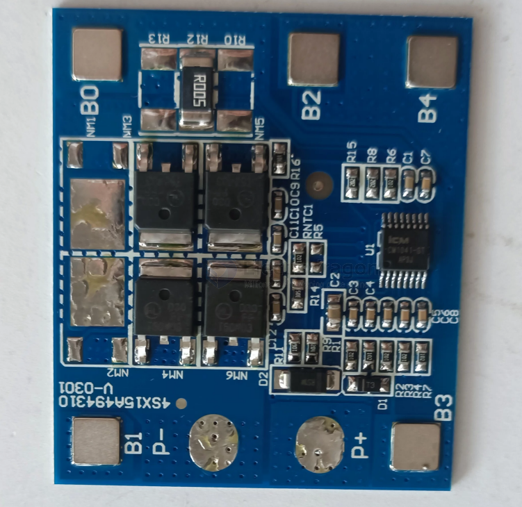
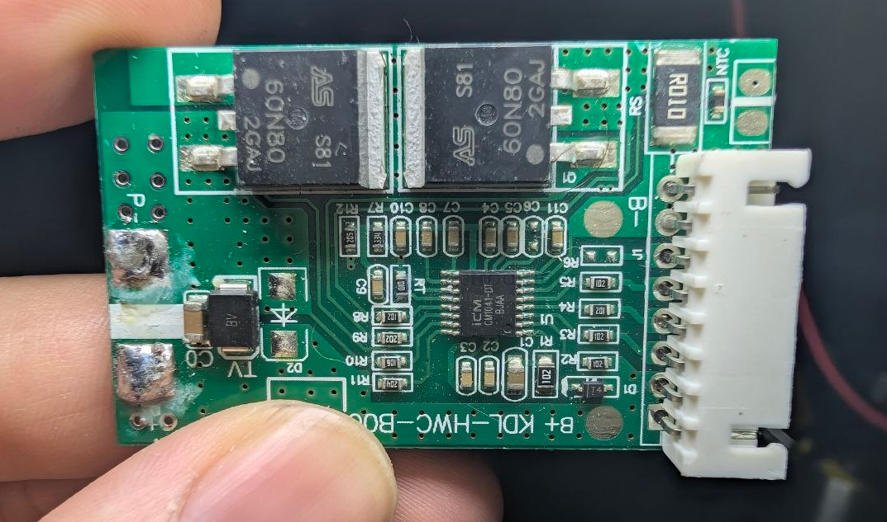

# ICM1041-dat

- [[ICM-dat]] - [[ICM1041-dat]] - [[battery-protector-dat]] - [[battery-protector-4s-dat]]

## CM1041 == 4S

CM1041系列是一款专用于 4 串锂/铁电池的保护芯片，内置有高精度电压检测电路和电流检测电路，通过检测各节电池的电压、充放电电流及温度等信息，实现电池过充电、过放电、放电过电流、短路、充电过电流、过温等保护功能，可通过外接电容来调节过充电、过放电、过电流保护延时。

## build 

- [[onsemi-dat]] - [[onsemi-mosfet-dat]]

## ref 