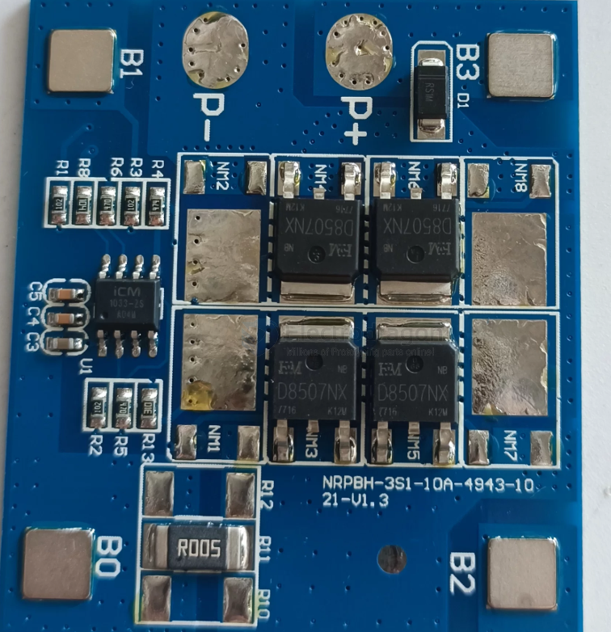
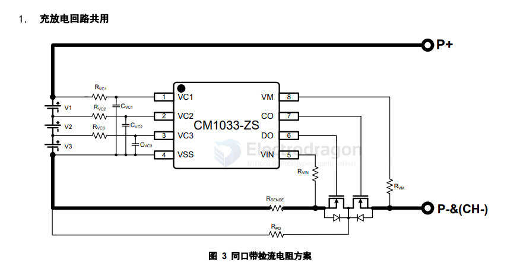
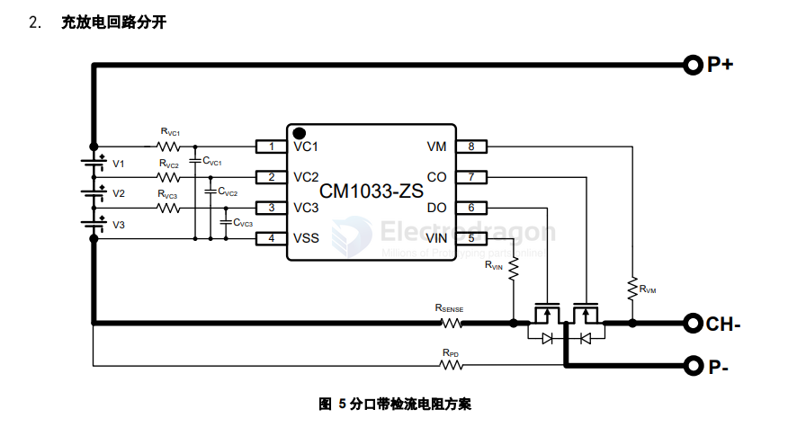
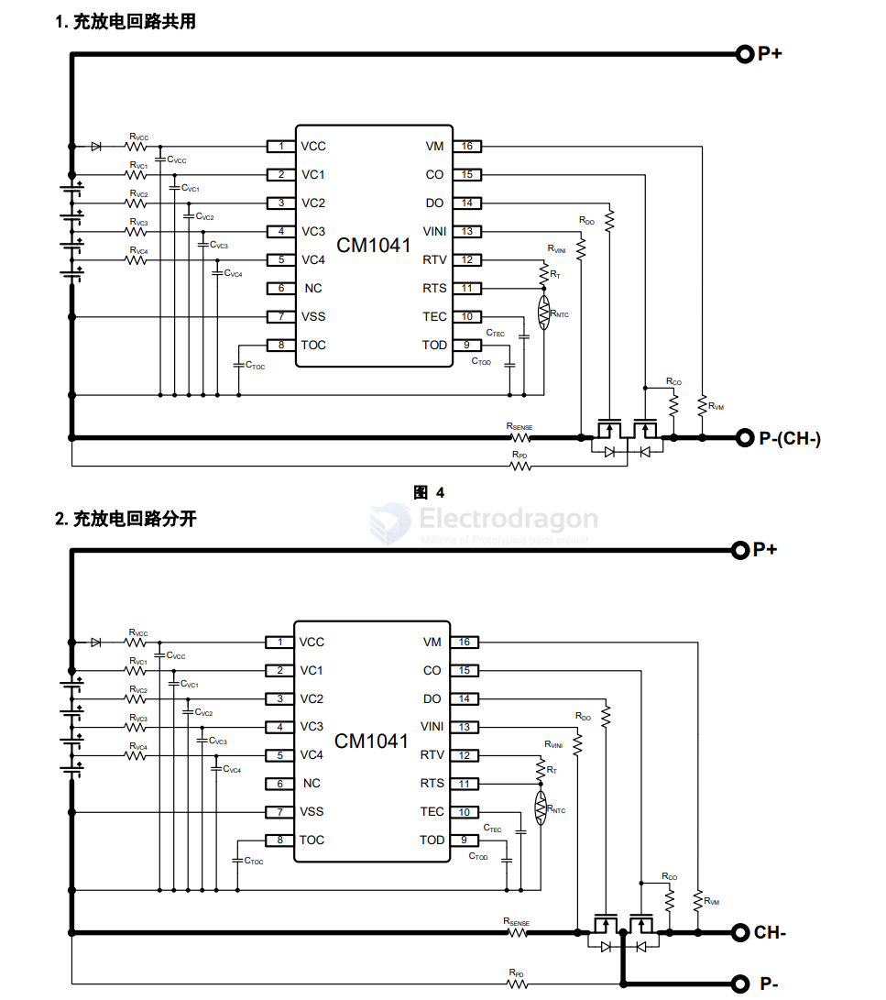

# ICM-semi-dat

- [[battery-protector-dat]] - [[battery-BMS-dat]]

## BMS 

http://icm-semi.com/page120

### 应用领域

- 电动工具
- 扫地机器人
- UPS 后备电源

## secondary protector 

CM1250/CM1270/12A0/CM1255 系列产内置高精度的电压检测电路和延迟电路，是专用于2~10串可充电电池组的二级保护芯片。通过检测每一节电池的电压，为电池包提供过充保护。

CM1251/CM1261/CM1273/CM12A3/CM12D3系列产品内置高精度的电压检测电路和延迟电路，是专用于5~13串可充电电池组的二级保护芯片，通过检测电池的电压，温度等信息，为电池包提供过充保护、过放保护和温度保护，所有保护延时均内置。

CM1236/CM1246/CM1247系列产内置高精度的电压检测电路和延迟电路，专用于3~4串可充电电池组的二级保护芯片，通过检测每一节电池电压，为电池包提供过充保护，同时具有LDO功能。

## full protector 

### 2S protector 

[2节-全功能保护](http://icm-semi.com/page134)

### multi-series protector

CM10X1/CM10X2系列产品是3~14节锂/铁电池保护芯片，可为电池组提供过充电、过放电、放电过电流、充电过流、短路高温充放电、低温充放电(可选)等全功能保护。

CM13X1/CM13X2系列产品是3~16节锂/铁/钠电池保护芯片，内置高精度电压检测电路和电流检测电路，通过检测各节电池的电压、充放电电流及温度等信息，实现电池过充电、过放电、均衡、断线、低压禁充、放电过电流、短路、充电过流和高低温保护等功能，放电过电流保护延时外置电容可调，其他保护延时内置。

[3~16节-全功能保护](http://icm-semi.com/page135)

## CM1033 == 3S

CM1033-ZS 是一款专用于 3 串锂/铁电池的保护芯片，内置有高精度电压检测电路和电流检测电路，通过检测各节电池
的电压、充放电电流等信息，实现电池过充电、过放电、放电过流、短路、充电过流等保护功能，所有保护延时均内置。

## CM1041 == 4S

CM1041系列是一款专用于 4 串锂/铁电池的保护芯片，内置有高精度电压检测电路和电流检测电路，通过检测各节电池的电压、充放电电流及温度等信息，实现电池过充电、过放电、放电过电流、短路、充电过电流、过温等保护功能，可通过外接电容来调节过充电、过放电、过电流保护延时。

## mosfet 

CMT9435S == 30V P-Channel MOSFET

- VDS -30 V
- Rds(on),typ@Vgs=-10V 48 mΩ
- Rds(on),typ@Vgs=-4.5V 78 mΩ
- ID -5 A

- [[mosfet-dat]]

## ref 

