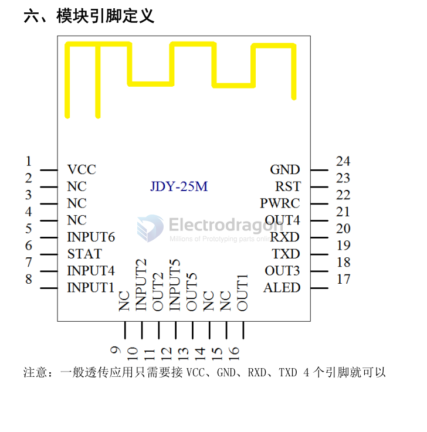

# JDY-25M-dat

legacy wiki page - https://www.electrodragon.com/w/JDY-25M

## boards 

- [[NBL1101-dat]]

## AT commands 

| Num. | CMD          | Funcs                               | Default          |
| ---- | ------------ | ----------------------------------- | ---------------- |
| 1    | AT           | 测试指令                            | -                |
| 2    | AT+RESET     | 复位                                | -                |
| 3    | AT+VERSION   | 固件版本                            | -                |
| 4    | AT+LADDR     | 读 MAC 地址                         | -                |
| 5    | AT+NAME      | 广播名读写                          | JDY-25M          |
| 6    | AT+PIN       | 连接密码设置                        | 123456           |
| 7    | AT+TYPE      | 是否打开密码连接方式                | 0                |
| 8    | AT+BAUD      | 波特率                              | 9600             |
| 9    | AT+DISC      | 断开连接                            | -                |
| 10   | AT+STAT      | 读取连接状态                        | 0                |
| 11   | AT+STARTEN   | 开机睡眠设置                        | 1                |
| 12   | AT+ADVIN     | 广播间隔                            | 1                |
| 13   | AT+POWR      | 发射功率                            | 3                |
| 14   | AT+ROLE      | 工作模式设置                        | 0                |
| 15   | AT+SLEEP     | 睡眠指令                            | -                |
| 16   | AT+DEFAULT   | 恢复出厂配置                        | -                |
| 17   | AT+INQ       | 主机搜索从机广播                    | -                |
| 18   | AT+STOP      | 停止广播                            | -                |
| 19   | AT+CONN      | 连接扫描列表 ID 号                  | -                |
| 20   | AT+CONA      | 指令 MAC 地址连接                   | -                |
| 21   | AT+BAND      | 绑定从机 MAC 地址                   | -                |
| 22   | AT+CLRBAND   | 清除绑定                            | -                |
| 23   | AT+SRBAND    | 连接周边信号最强的从机              | -                |
| 24   | AT+MESH      | MESH 发数据                         | -                |
| 25   | AT+KEY       | 按键参数配置                        | -                |
| 26   | AT+NETID     | 组网 ID 号配置                      | 1189             |
| 27   | AT+MADDR     | 组网短地址                          | MAC 地址后两位   |
| 28   | AT+MCLSS     | 组网设备类型                        | 0（路由器）      |
| 29   | AT+FRIEND    | 添加私密朋友 MAC 地址               | 000000000000     |
| 30   | AT+CLRFRIEND | 清除朋友                            |
| 31   | AT+FRTYPE    | 朋友类型                            | 0                |
| 32   | AT+IBUUID    | iBeacon 的 UUID 配置                |
| 33   | AT+MAJOR     | iBeacon 的 MAJOR 配置               | 000A             |
| 34   | AT+MINOR     | iBeacon 的 MINOR 配置               | 0007             |
| 35   | AT+IBSING    | iBeacon 的 SING 配置                |
| 36   | AT+ENLOG     | 串口输出状态开关                    | 1（开）          |
| 37   | AT+DATA      | 从机多连发数据指令                  |
| 38   | AT+CUIO      | 串口设置当前模块输出 IO电平         |
| 39   | AT+TGIO      | 主机通信时主机控制从机输出 IO电平   |
| 40   | AT+FUNC      | 主机设置从机无线参数                |
| 41   | AT+SUBTYPE   | 子功能类型（路由模式有效）          | 0                |
| 42   | AT+LEARN     | 学习开关                            | 0                |
| 43   | AT+LEAVAL    | 输出 IO 学习参数                    | 0,0,0000         |
| 44   | AT+DEVCLSS   | 用于一键主机连接周边信号最强的从机  | 0                |
| 45   | AT+KLABEL    | 添加标签地址 (支持 10 个标签)       | 0,0,000000000000 |
| 46   | AT+KLTIME    | 设置标签超时时间                    | 3s               |
| 47   | AT+KLRSSI    | 设置标签灵敏度 （用于接收范围设置） | 99               |
| 48   | AT+ALED      | 广播 LED 开关                       | 1                |

## ref 

- [[BLE-dat]]

- https://github.com/Edragon/JDY-25M