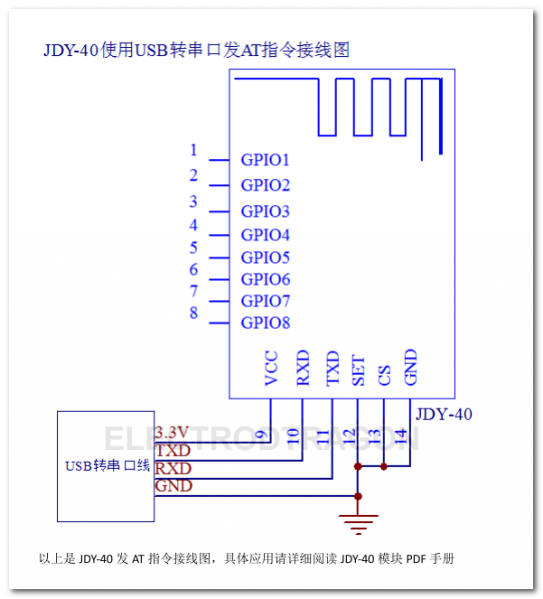

# JDY-40-dat

## SCH 

## Config 

| PIN | Description      | Pull LOW    | Pull HIGH              |
| ----- | ---------------- | ----------- | ---------------------- |
| SEL   | Mode Select      | AT Commands | Data Transmission Mode |
| CS    | Chip Select Mode | Wakeup Mode | Sleep Mode *           |
| TXD   | Data TX          | -           | -                      |
| RXD   | Data RX          | -           | -                      |

## ref 

- [[EY-40_English_manual.pdf]]

- [[JDY-dat]]