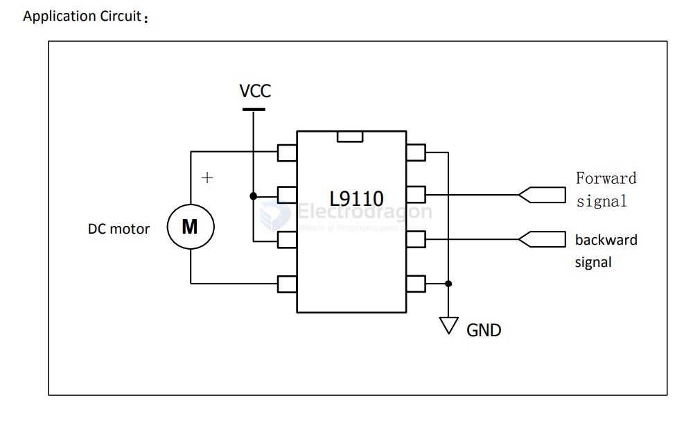
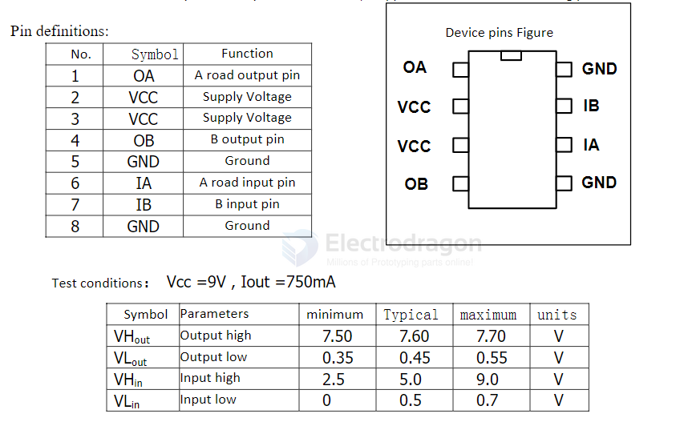

# L9110-dat

- datasheet = [[datasheet-l9110.pdf]]

- [[SDR1056-dat]]

- good for 3.3V motor to drive 

- alternative [[HG7881-dat]]

## APPs 

Wide supply voltage range: 2.5V-12V;

## Key Specifications & Features

| Feature                   | **L9110 / L9110S**                                                          | **DRV8871**                                                                       |
| ------------------------- | --------------------------------------------------------------------------- | --------------------------------------------------------------------------------- |
| **Type / Configuration**  | Dual-channel H-bridge. Can drive two DC motors or one 4-wire stepper motor. | Single full-bridge (one motor or one winding of stepper) driver.                  |
| **Supply Voltage Range**  | ~2.5V to 12V                                                                | ~6.5V to 45V                                                                      |
| **Logic / Input Voltage** | TTL/CMOS levels, works with 3.3V & 5V controllers                           | Up to ~5.5V logic input                                                           |
| **Current Capability**    | Continuous: ~0.75-0.8 A per channel; peak ~1.5-2 A short-term               | Peak ~3.6 A; RDS(on) ~565 mΩ (HS + LS)                                            |
| **Protection Features**   | Basic: clamp diodes, limited protection                                     | Advanced: undervoltage lockout, overcurrent, thermal shutdown, current regulation |
| **Power Efficiency**      | Higher losses at moderate load; best for low power                          | Efficient at higher loads; better handling of stress                              |
| **Cost & Size**           | Very low cost, simple dual-channel module                                   | Higher cost, more complex, industrial-grade                                       |

## ref 

- [[dc-motor-driver-dat]]