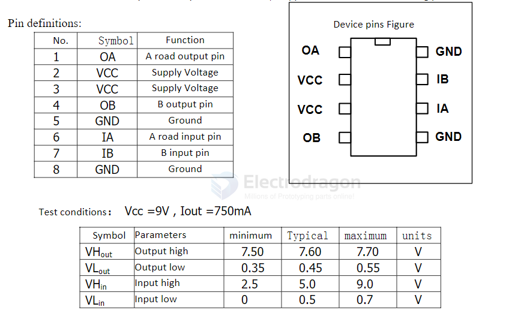

# L9110S-dat

- datasheet = [[datasheet-l9110.pdf]]

- [[SDR1056-dat]]

- good for 3.3V motor to drive 

- alternative [[HG7881-dat]]

## APPs 

Wide supply voltage range: 2.5V-12V;

## ref 

- [[dc-motor-driver-dat]]