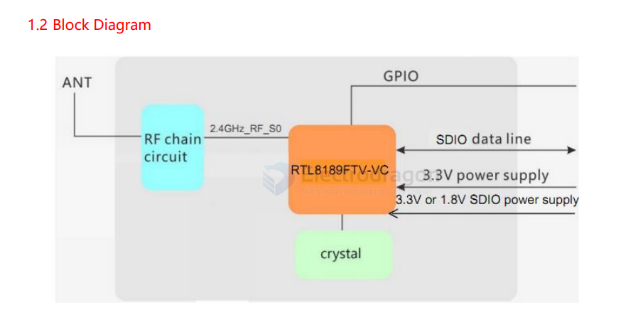
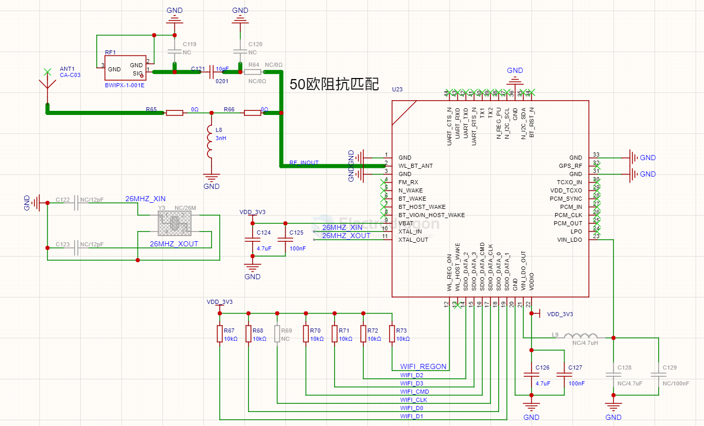
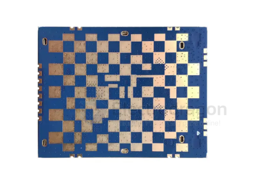
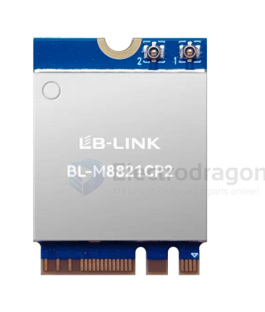

# LB-link-dat

- [[LB-link-dat]] - [[WIFI-dat]] - [[BL-M8189FS6]] - [[SDIO-dat]]

## BL-M8189FS6

BL-M8189FS6(VC) == 802.11n 150Mbps WiFi SDIO Module Specification

### diagram 

### build SCH 

## M8192EU9 2T2R 802.11b/g/n WiFi Module

## M8821CP2 1T1R 802.11a/b/g/n/ac WiFi + BT5.0-Compliant Module

## ref 

