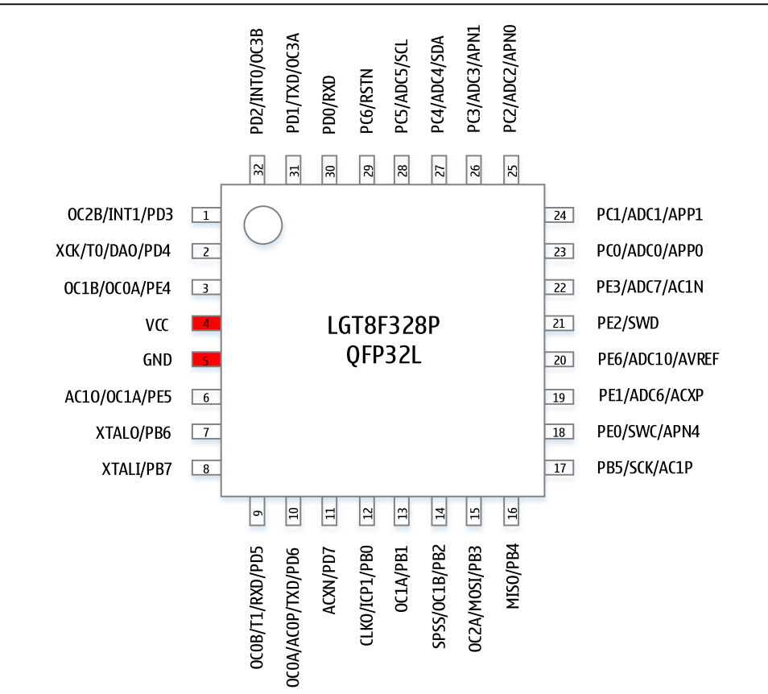
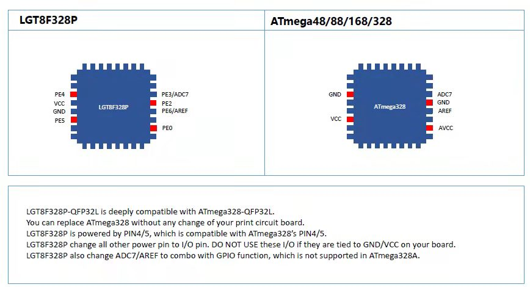
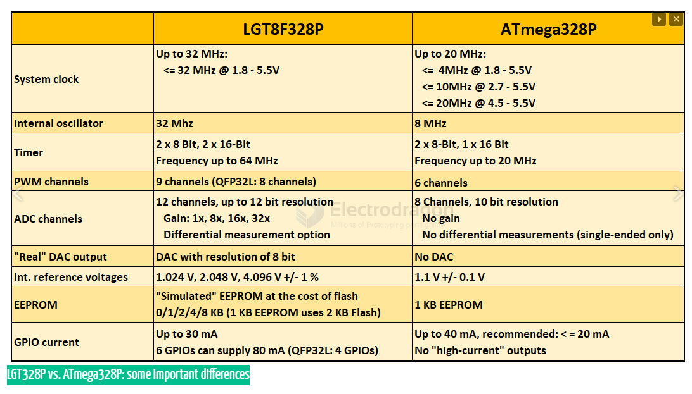
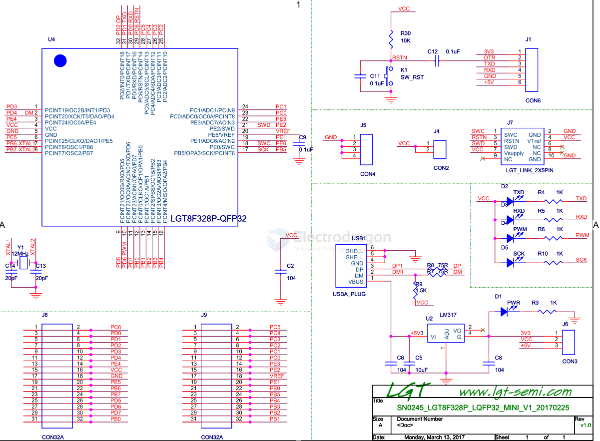
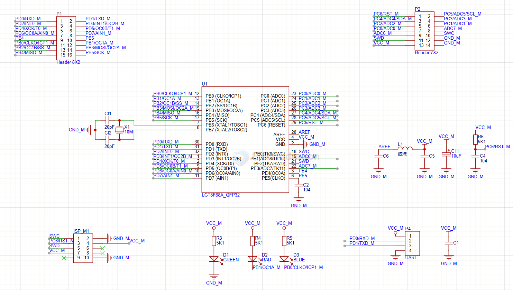
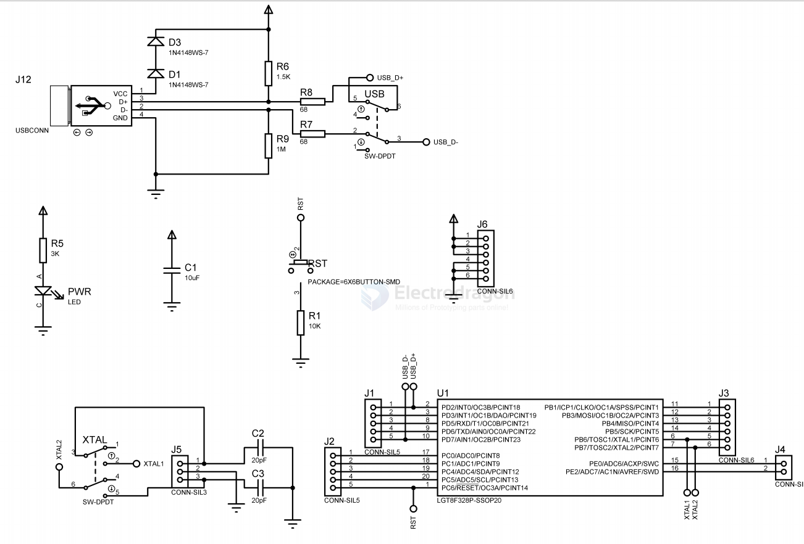

# LGT8F328-DAT

- [legacy wiki page](https://www.electrodragon.com/w/Logicgreen)

- [[LGT8F328-DAT]] - [[LGT8F328-SSOP20-dat]] - [[LGT8F328-SDK-DAT]] - [[LGT-dat]]

- [[arduino-dat]] - [[arduino-uno-dat]]

## chip and board 

- [[CIC1053-dat]] - [[LGT8F328-DAT]]

- [[DVA1009-dat]] - [[DAR1056-dat]] - [[NWL1097-dat]]

- [[DVA1014-dat]] - [[DVA1018-dat]]

## comparison to arduino atmega328

| pin | LGT     | arduino | note      |
| --- | ------- | ------- | --------- |
| 3   | PE4     | GND     | extra pin |
| 6   | PE5     | VCC     | extra pin |
| 18  | PE0/SWC | AVCC    | prog port |
| 21  | PE2/SWD | GND     | prog port |
| 4   | VCC     | VCC     | common    |
| 5   | GND     | GND     | common    |

common pin 
- pin 4 = VCC
- pin 5 = GND

## LGT8F328-QFP MIN SYS 

## periperhals 

- [[UART-dat]] - [[GPIO-dat]] - [[PWM-dat]] - [[ADC-dat]] - [[DAC-dat]]

## LGT8F88A-QFP32 MIN System 

## APP 

### USB Demo 

## demo 

https://www.youtube.com/shorts/CL2-iH4KWQQ

## ref

- [[LGT8F328]]

- [[LGT]]