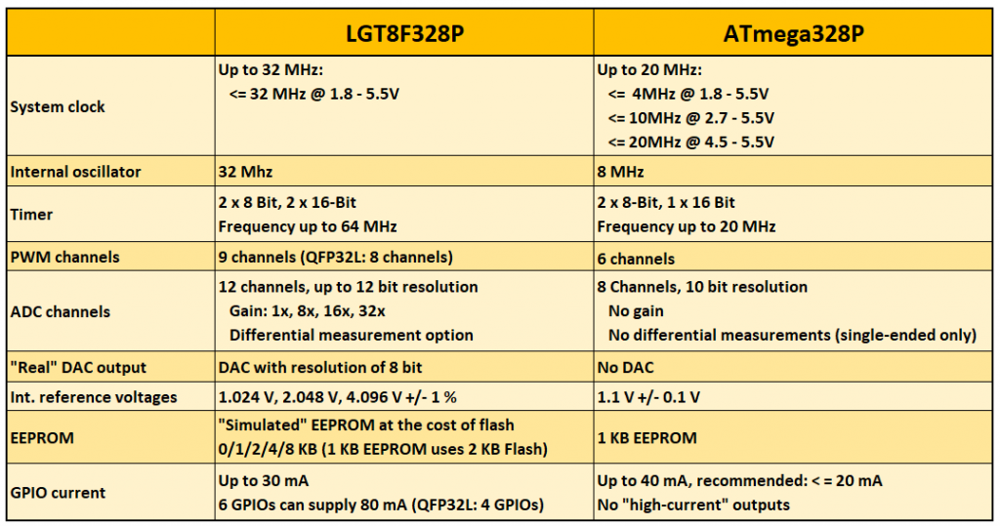

# LGT8F328-DAT

- [legacy wiki page](https://www.electrodragon.com/w/Logicgreen)

- [[LGT8F328-DAT]] - [[LGT8F328-SSOP20-dat]] - [[LGT8F328-SDK-DAT]] - [[LGT-dat]]

- [[arduino-dat]] - [[arduino-uno-dat]]

## chip and board 

- [[CIC1053-dat]] - [[LGT8F328-DAT]]

- [[DVA1009-dat]] - [[DAR1056-dat]] - [[NWL1097-dat]]

- [[DVA1014-dat]] - [[DVA1018-dat]]

## comparison to arduino atmega328

| pin | LGT     | arduino | note      |
| --- | ------- | ------- | --------- |
| 3   | PE4     | GND     | extra pin |
| 6   | PE5     | VCC     | extra pin |
| 18  | PE0/SWC | AVCC    | prog port |
| 21  | PE2/SWD | GND     | prog port |
| 4   | VCC     | VCC     | common    |
| 5   | GND     | GND     | common    |

common pin 
- pin 4 = VCC
- pin 5 = GND

view main differences between LGT8F328 and atmega328 - source: https://wolles-elektronikkiste.de/en/lgt8f328p-lqfp32-boards

## LGT8F328-QFP MIN SYS 

## periperhals 

- [[UART-dat]] - [[GPIO-dat]] - [[PWM-dat]] - [[ADC-dat]] - [[DAC-dat]]

## LGT8F88A-QFP32 MIN System 

## other MCUs 

LGT8F88A, LGT8Fx8D and LGT8Fx8P main differences

 

|             -              |   -   |                        LGT8F88A                         |                       LGT8Fx8D                        |                            LGT8Fx8P                             |
| :------------------------: | :---: | :-----------------------------------------------------: | :---------------------------------------------------: | :-------------------------------------------------------------: |
|          Progmem           |  KB   |                            8                            |                       4/8/16/32                       |                             8/16/32                             |
|            RAM             |  KB   |                            1                            |                       0.5/1/1/2                       |                              1/1/2                              |
|    Data Flash (EEPROM)     |  KB   |                        504 byte                         |                 1/2/4/progmem shared                  |                       2/4/progmem shared                        |
|        DAC (8 bit)         |       |                            -                            |                           2                           |                                1                                |
|     Internal Reference     |   V   |                        1.25/2.56                        |                       1.25/2.56                       |                        1.024/2.048/4.096                        |
|  Analog Comparators (AC)   |       |                            2                            |                           2                           |                                2                                |
|       AC resolution        |  mV   |                            6                            |                          12                           |                               10                                |
| DAP Differential Amplifier | gain  |                     7.5/15/22.5/30                      |                           -                           |                            1/8/16/32                            |
|            ACD             |  bit  |                           10                            |                          12                           |                               12                                |
|         Max sysclk         |  MHz  |                           32                            |           32 div 2 internal or 20 external            |                               32                                |
|           Extras           |       | Capacitive touch button controller,   Thermal sensor | 2x Operational Amplifier   fixed gain = +12 or -11 | DSC (16 bit arithmetic),   SPI buffer, SPI 2 wire input mode |
|          Package           |       |                      QFP32, SSOP28                      |             QFP32, SSOP28, SSOP24, SSOP20             |                      QFP48, QFP32, SSOP20                       |

## APP 

### USB Demo 

## demo 

https://www.youtube.com/shorts/CL2-iH4KWQQ

## ref

- [[LGT8F328]]

- [[LGT]]