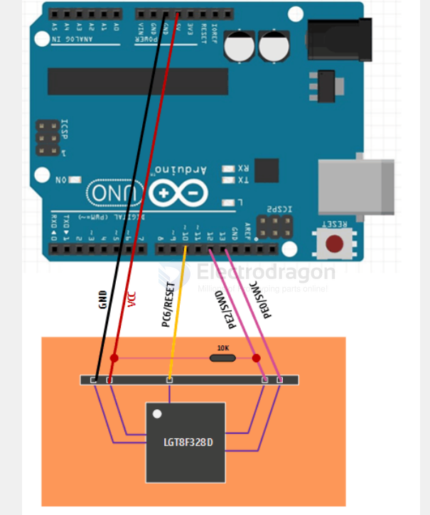
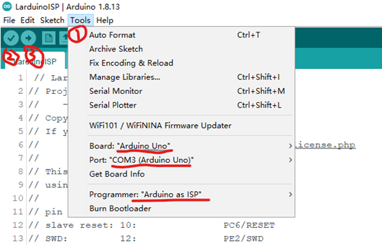
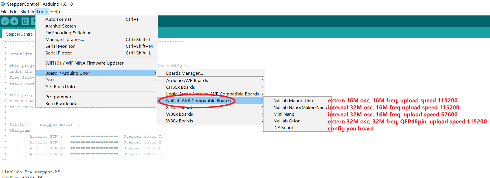
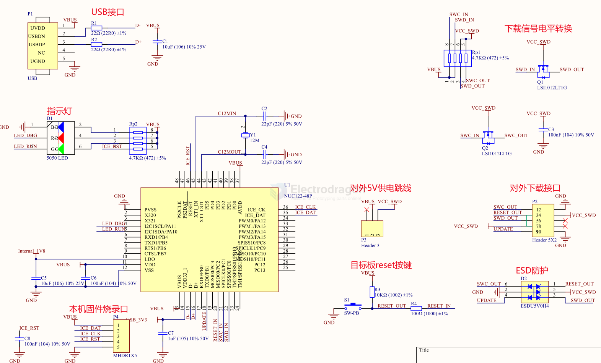

# LGT8F328-SDK-DAT

- [[lgt8f328-dat]]

- [[SWDICE-dat]]

- [[VisualGDB]]

## programming interface 

- GND2/AREF/`SWD`/PE2
- AVCCI/`SWC`/PEO
- PC6(/RESET)
- +3V3
- GND

## Sketch uploads By Arduino IDE
- Pre-loaded bootloder. Just select corresponding board to upload sketch, refer to bootloader sketch below
- Programming pin port same as FTDI [[FT232-dat]], same as arduino pro mini
- A backup method for without DTR, just hold down RESET button when "compiling", then release when "uploading".

## ISP 

larduino - ISP 

https://github.com/Edragon/LGTISP

https://github.com/LGTMCU/LarduinoISP

## bootloader

### dbuezas/lgt8fx - LGT8fx Boards by dbuezas

https://github.com/dbuezas/lgt8fx

https://raw.githubusercontent.com/dbuezas/lgt8fx/master/package_lgt8fx_index.json

for [[DVA1009-dat]]

### nullab board 

Nulllab_AVR_Compatible_Boards by nullab.org

- most compatible, please use this one
- Nullab Nano/ Maker Nano
- install by this - https://nulllab.coding.net/p/lgt/d/nulllab_lgt_arduino/git/raw/master/package_nulllab_boards_index_zh.json
- link2 == https://raw.githubusercontent.com/nulllaborg/arduino_nulllab/master/package_nulllab_boards_index.json

https://github.com/nulllaborg/arduino_nulllab?tab=readme-ov-file

Failed to install platform: 'Nulllab_AVR_Compatible_Boards:2.0.0'. 13INTERNAL: Cannot install platform: installing platform nullab avr

compatible boards:avr@2.0.0: testing local archive integrity: testing archivechecksum: missing checksum for: master.zip

### old 1

https://github.com/LGTMCU/Larduino_HSP
Installation:

- Unzip master.zip
- Copy the [hardware] directory to Arduino's sketchbook directory (see below to find out where it normally resides)
- Restart Arduino, you will see new board from [Tools]->[Board] menu.

### old 2 bootloader

- Better not used for experiment, your often daily programming learning or testing, although no problem, but if unexpected error cause the board bricked, you need special programmer to re-programme the bootloader.
- Good to migrate to a low cost board instead of original expensive board.
- Same way to upload sketch as pro mini, notice to choose the board
  - 8F328P - original IC bootloader, please use this one
  - 8F328D - compatible, can also upload code, but don't know if any unknow error.
  - Pro mini - also can upload, but active very wired

## Chip Note 

- crystal is not soldered, it can work without crystal, unlike [[atmega328]]

## Programmer

- arduino UNO can pretend as a chip programmer
- please contact us if you need to order original programmer

## programmer SCH 

## ref 

- [[LGT8F328-dat]] - [[LGT-dat]]