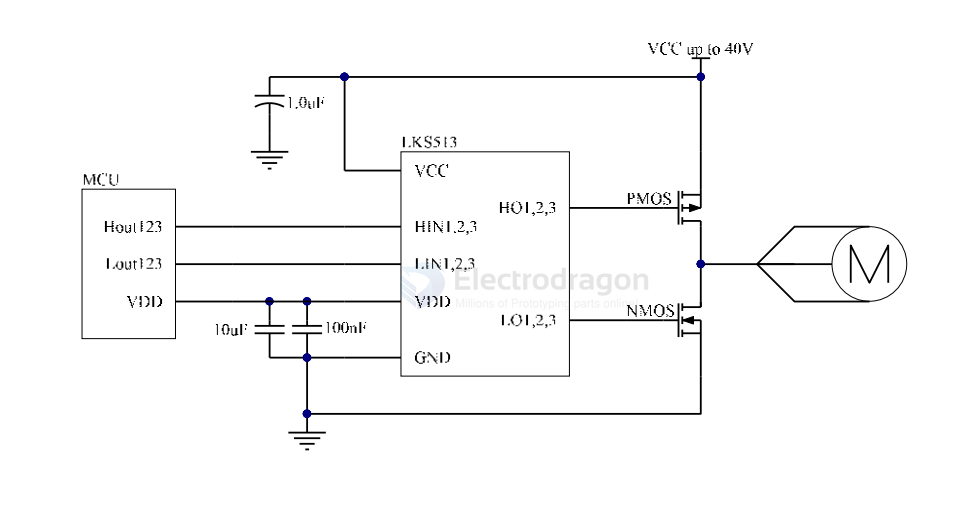
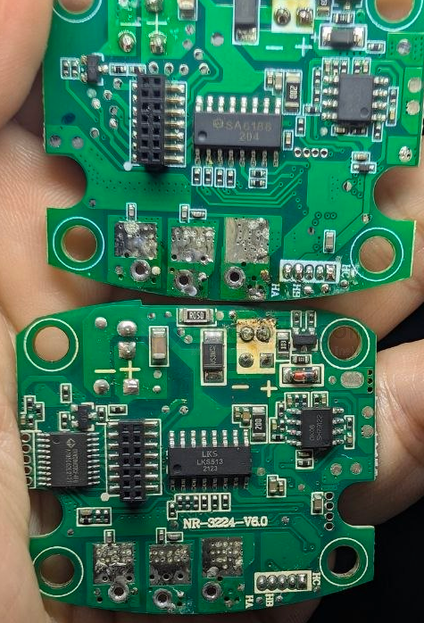

# LK513-dat

- [[LK513-dat]] - [[LKS-dat]] - [[sytatek-dat]] - [[motor-driver-BLDC-dat]]
 
3-Phase 40V P/N MOS Pre-Driver

https://sjk.lksmcu.com/static/upload/file/20230113/LKS513_Datasheet_v1.3.pdf

The LKS513 is a three-phase 40V, high speed half-bridge pre-diver for power P/N MOSFET. It has two inputs for high side and low side, and two outputs per channel with internal dead time to avoid cross-conduction.

The input logic level is compatible with 3.3V/5V/15V signal. Output 10V gate voltage for both PMOS and NMOS.

It also built in a 5V/30mA LDO for MCU or other device power supply, and have thermal shut down protection for safety.

## APPs 

## build 

- [[MCU-dat]] - [[GVM-dat]] - [[LK513-dat]]

## ref 

