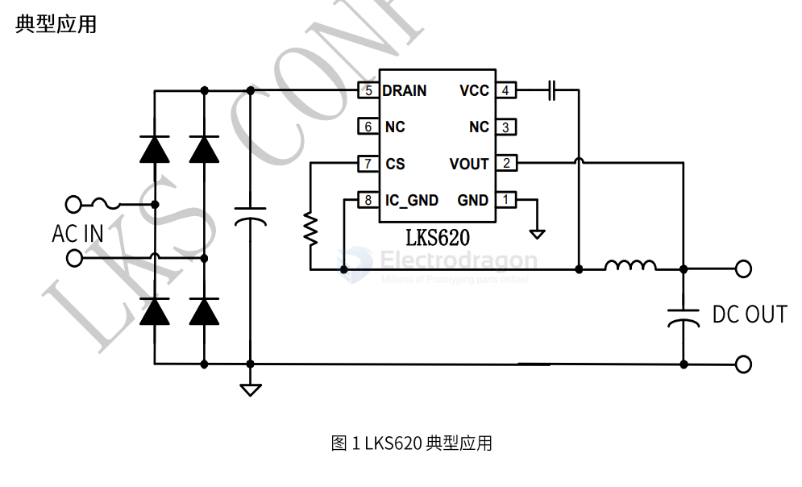

# LKS620-dat

- [[LKS620-dat]] - [[LKS-dat]]

LKS620是一款高集成度低待机功耗的非隔离降压型恆压驱动芯片。适用于20Vdc*~265Vac全电压输入的非隔离电源。

*受到Dmax限制，当Vin<30Vdc，Vo可能低于15V。当Vin=20Vdc，Vo典型值：约13V，Vo最小值：约10V。

LKS620芯片内部集成500V功率开关以及续流二极管，采用电压电流控制技术，不需要外部环路补偿电容，即可实现优异的恒压特性，极大的节约了系统成本和体积。
LKS620芯片采用多模式控制技术，并从输出电压经过芯片内部供电二极管给VCC供电，有效降低系统待机功耗，提高效率，并减小系统工作在轻载时的噪声。

LKS620采用SOP-8封装。

https://sjk.lksmcu.com/static/upload/file/20230113/LKS620_Datasheet_v0.9.pdf

## ref 

