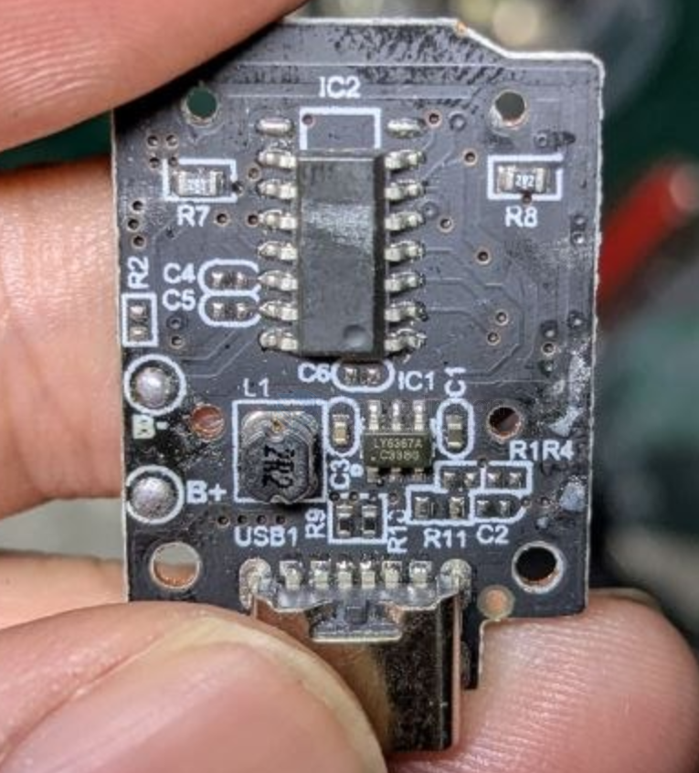

# LY6367A-dat

- [[battery-charge-boost-dat]] - [[battery-charger-dat]]

## Features

- Proprietary control circuit, perfectly supporting PCB trace inductance
- Standby current: 7μA
- Charging current: 180mA/400mA optional
- Maximum discharge current: 600mA
- Supports MCU direct reading of charge/discharge status
- Output overvoltage, short circuit, and overcurrent protection
- Automatic identification of earphone placement, automatic shutdown under light load
- Intelligent temperature control
- Boost efficiency up to 91%
- SOT23-6 package

## Overview

LY6367 is a fully integrated power management chip for Bluetooth charging cases, integrating lithium battery charging management, synchronous boost converter, battery power management, and protection function modules.

LY6367 uses a proprietary boost control circuit structure that perfectly supports PCB trace inductance, greatly reducing solution size and cost.

LY6367 offers two charging current versions: 180mA and 400mA, with a maximum discharge current of 600mA. It supports MCU direct reading of charging, fully charged, discharging, and standby status.

## Applications

- Bluetooth earphone charging cases

- Power banks

- Charging + boost output applications
