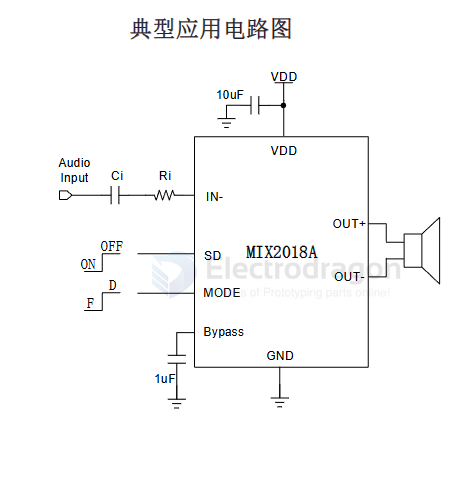

# MIX2018A-dat

-83dB 0.08% 1-Channel 2.5V~5V 3mA 60dB 82% Automatic mute/no-noise switch、Enable/disable function、Filterless architecture Class F ESOP-8 Audio Amplifiers ROHS

- [[MIX2018A-datasheet.pdf]]

MIX2018A是一款高效率、无滤波器5W单声道F类音频放大器。超低的EMI非常适合应用于带FM功能的便携式设备中。

MIX2018A的单端输入架构和极高的PSRR有效地提高了MIX2018A对RF噪声的抑制能力。无需滤波器的PWM调制结构及增益内置方式减少了外部元件、PCB面积和系统成本,并简化了设计。高达90%的效率,快速地启动时间和纤小的封装尺寸使得MIX2018A成为便携式音频产品的最佳选择。

MIX2018A具有关断功能，极大的延长系统的待机时间。过热保护功能增强系统的可靠性。POP声抑制功能改善了系统的听觉感受，同时简化系统调试

MIX2018A提供带散热片的ESOP8封装

## APP 

## ref 

