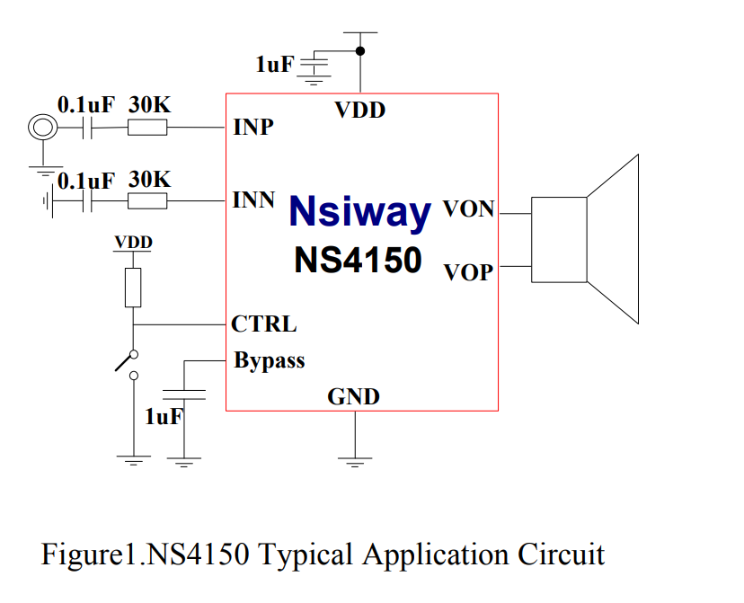

# NS4150

- [[NWI1241-dat]]

http://inder.cn/WJXZ/nsiway/InderNS4150EN.PDF

## bead value 

Key Parameters to Consider

### Impedance at High Frequencies:

The ferrite bead should provide high impedance at the problematic frequencies you want to suppress (e.g., >30 MHz to meet FCC/CE standards).
A typical bead might have 600-1200 Ω at 100 MHz, which is common for suppressing radiated emissions.

### Low Impedance at Low Frequencies:

The ferrite bead should have low DC resistance and minimal impedance at audio frequencies (<20 kHz) to avoid degrading audio quality.
Look for beads with DC resistance in the range of 10-100 mΩ.

### Current Rating:

The ferrite bead must handle the maximum current of your speaker system without saturating. For the NS4150, consider the peak output current, which depends on the amplifier’s load and power rating.

## ref 

- [[NS4150]]