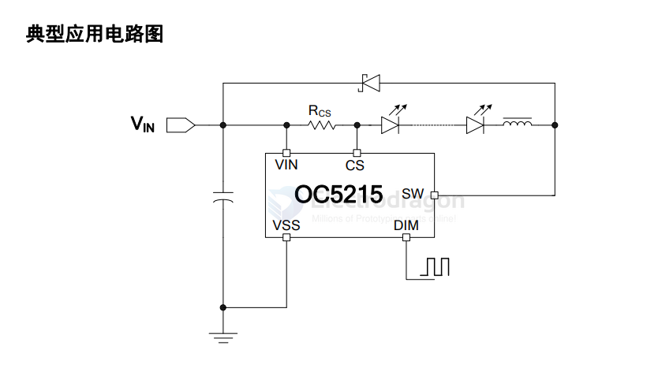
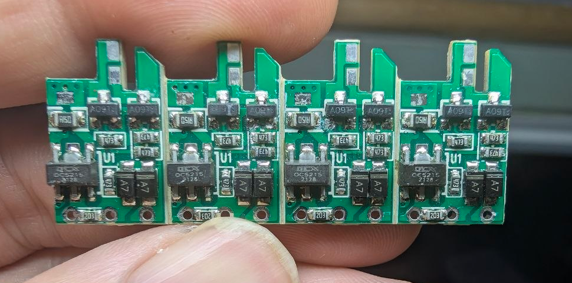
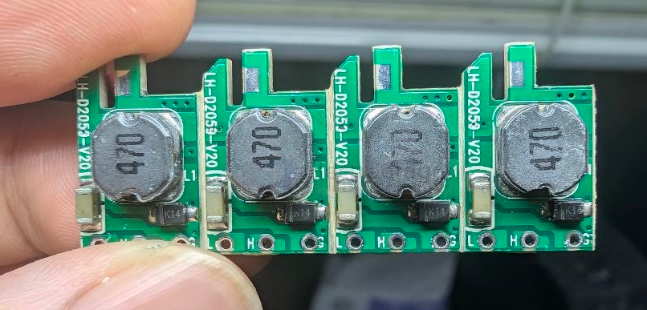

# OC5215-dat

- [[OCX-dat]] - [[led-driver-dat]] - [[OC5021-dat]]

- [[OC5215-dat]]

OC5215

30V, 1.5A 高端电流检测降压 LED 恒流驱动器

概述
OC5215 是一款连续电感电流导通模式的降压型 LED 恒流驱动器，用于驱动一个或多个 LED 灯串。OC5215 工作电压从5.5v 到 30v，提供可调的输出电流，最大输出电流可达到 1.5A。根据不同的输入电压和外部器件，OC5215 可以驱动供高达数十瓦的 LED。

OC5215 内置功率开关，采用高端电流检测电路，以及兼容 PWM 和模拟调光的调光脚 DIM。当 DIM 脚电压低于 0.3v时输出关断，进入待机状态。

OC5215 内置过温保护电路，当芯片达到过温保护点进入过温保护模式，输出电流逐渐下降以提高系统可靠性。

OC5215 采用专利的电路架构使得在低压差工作时输出电流无过冲，提高 LED工作寿命，OC5215 采用专利的恒流电路具有优异的负载调整率和线性调整率。

OC5215 采用 SOT89-5 和 ESOP8 封装。

## SCH 

## build 

## ref 