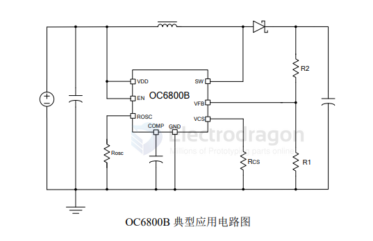

# OC6800B-dat

- [[OCX-dat]] - [[OC6800B-dat]] - [[dcdc-boost-down-dat]]

内置 100V/5A MOS 升压/升降压型 DC-DC 

OC6800B 是一款专为升压、升降压开关电源设计的专用 DC-DC，芯片内置100V/5A 功率管。

OC6800B典型应用支持5-36V输入电压范围。输出电压小于 100V。

芯片采用固定频率的 PWM 控制方式并在轻载条件下自动降频提高转换效率。

芯片内置高精度误差放大器、振荡器，以及频率补偿电路，简化了外围设计。芯片内置过流保护以及 EN 脚关断功能。

芯片工作频率可通过一个外接电阻调节，方便根据不同应用设置系统工作频率。OC6800B 内部集成了软启动以及过温保护电路，减少外围元件并提高系统可靠性。

OC6800B 采用 ESOP8 封装。散热片内置接 SW 脚。

## APP 

## ref 

