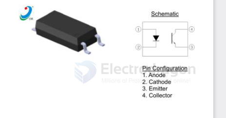

# Orient-Tech-dat

- [[Orient-Tech-dat]] - [[OR-1009-dat]] - [[optical-coupler-dat]] - [[acdc-dat]]

0R-1009 - datasheet == [[OR-1009.pdf]]

The OR-10XX series devices consist of an infrared emitting diode, optically coupled to a phototransistor detector.They are packaged in a 4-pin SOP package.

## ref 

