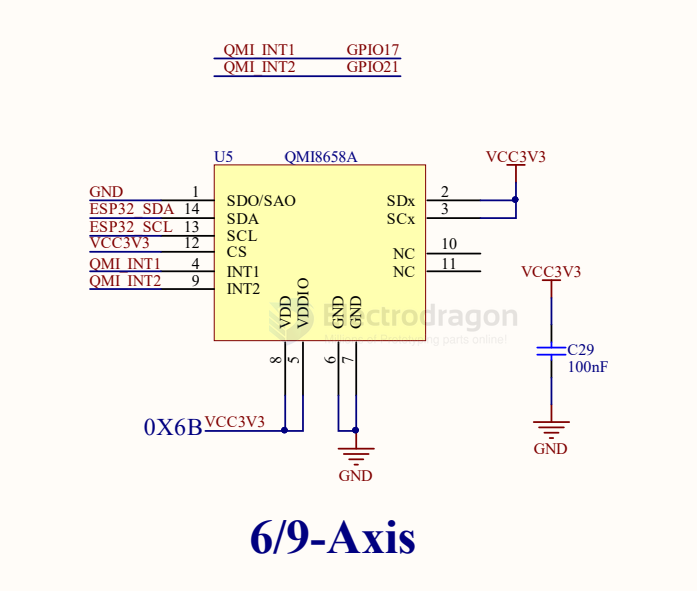

# QMI8658A-dat

QMI8658A DATASHEET

Low Noise, Wide Bandwidth 6D Inertial Measurement Unit with Motion Co-Processor

The QMI8658A is a complete 6D MEMS inertial measurement unit (IMU). With tight board-level gyroscope sensitivity of ±3%, gyroscope noise density of 13 mdps/√Hz, and low latency, the QMI8658A is ideal for consumer and industrial applications.

The QMI8658A incorporates a 3-axis gyroscope and a 3-axis accelerometer. It provides a host-processor interface supporting I3C, I2C and 3-wire or 4-wire SPI.

With its built-in digital functionality, low power, and small size, the QMI8658A is the ideal part for applications requiring motion-based functionality.

## APP 1. 

## ref 

- [[6-axis-dat]]