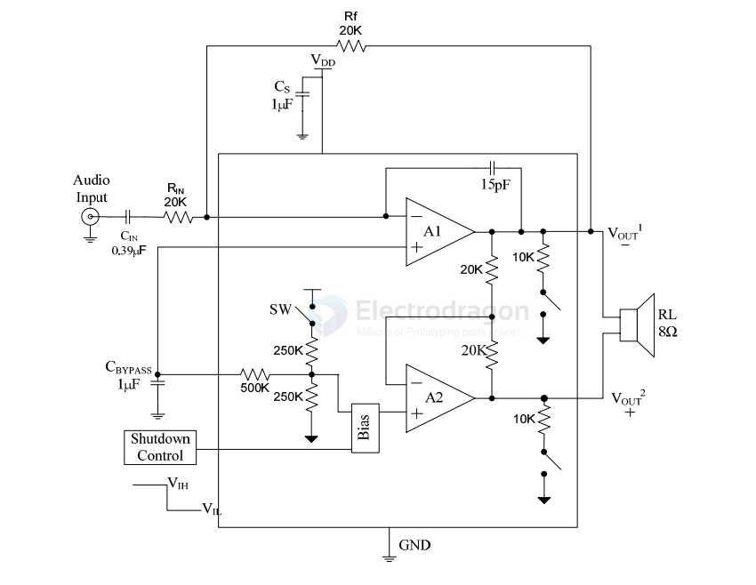
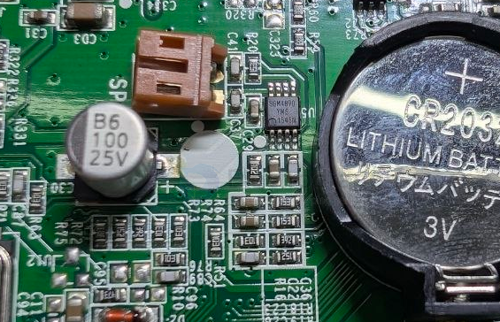

# SG-micro-dat

- [[SGM4890-dat]] == 1.1 Watt Audio Power Amplifier - [[speaker-dat]]

SGM3732YTN6G/TR TSOT-23-6 38V升压LED驱动器IC芯片 - [[SG-micro-dat]]

SGM3732 - PWM Dimming, 38V Step-Up LED Drive

## ref 

