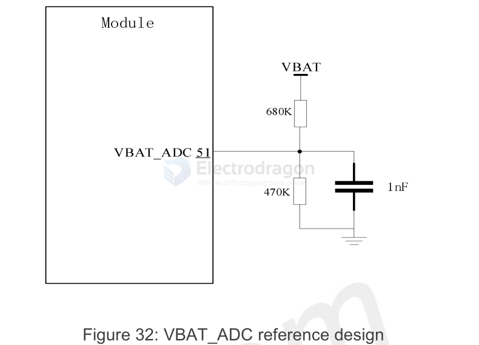

# A7670 DAT

- LTE-FDD / LTE-TDD

* Default baudrate is 115200

- read more general info at page [[M2M-dat]]

## A7670 versions 

| module suffix | FDD                          | TDD                 |
| ------------- | ---------------------------- | ------------------- |
| C             | B1/B3/B5/B8                  | B34/B38/B39/B40/B41 |
| E             | B1/B3/B5/B7/B8/B20           | B34/B38/B39/B40/B41 |
| SA            | B1/B2/B3/B4/B5/B7/B8/B28/B66 | B34/B38/B39/B40/B41 |

- [[LTE-net]] - [[M2M-dat]]

## Hardware Design 

| functions   | check |                            |
| ----------- | ----- | -------------------------- |
| SIM / USIM2 | ✔     | SIM1 + SIM2                |
| PCM         | x     |                            |
| BT          | ✔     | BT5 + tradtional           |
| GNSS        | ✔     |                            |
| GPIOx       | ✔     |                            |
| Keyboardx   | ✔     | 4x4                        |
| ADC         | ✔     | VBAT_ADC                   |
| SPI         | ✔     |                            |
| I2C         | ✔     |                            |
| UART        | ✔     | UART main, UART Log, UART3 |
| SPK         | ✔     |                            |
| MIC         | ✔     |                            |
| LCD         | ✔     |                            |
| CAM         | ✔     |                            |
| USB         | ✔     | USB2.0                     |

### USB Functionalties 

the modern and COMs 

### Power Supply 

When the module transmits at maximum power in LTE mode, the instantaneous peak current can reach up to 1A, resulting in a large voltage drop on VBAT. To ensure the voltage drop is less than 300mV, the external power supply must be capable of providing at least 1A.

When the power supply can provide a continuous current of 1A, the total capacitance of the external power supply capacitor is recommended to be no less than 200uF. If a continuous current of 1A cannot be provided, the total capacitance of the external capacitor is recommended to be no less than 600uF to ensure that the voltage drop on VBAT does not exceed 300mV at any time.

#### A7672X/A7670X has 2 LDO outputs：VDD_1V8 and VDD_2V8.

VDD_1V8 is the module's system IO power supply, which can only provide a current capacity of 50mA. It cannot be used as a high current drive source. It can be used as a power supply for module 1V8_GNSS （PIN97）.

VDD_2V8 is the module 2.8V LDO power output, which can only provide a current capacity of 50mA. It cannot be used as a high current drive source. It can be used as a power supply for LCD VCC_2V8.

### Keyboards 

| Signal  | Pin | Voltage | Type | Description                        |
| ------- | --- | ------- | ---- | ---------------------------------- |
| MK_IN2  | 47  | 1.8V    | DI   | Keyboard input If unused, keep it  |
| MK_IN3  | 20  | 1.8V    | DI   | Keyboard input If unused, keep it  |
| MK_IN5  | 68  | 1.8V    | DI   | Keyboard input If unused, keep it  |
| MK_IN6  | 36  | 1.8V    | DI   | Keyboard input If unused, keep it  |
| MK_OUT2 | 44  | 1.8V    | DO   | Keyboard output If unused, keep it |
| MK_OUT3 | 21  | 1.8V    | DO   | Keyboard output If unused, keep it |
| MK_OUT5 | 67  | 1.8V    | DO   | Keyboard output If unused, keep it |
| MK_OUT6 | 35  | 1.8V    | DO   | Keyboard output If unused, keep it |

### Bluetooth interface

A7672X/A7670X module has integrated Bluetooth function inside, and only one BT antenna is left on the module interface. 

A7672X/A7670X Support BT5.0 protocol specification, compatible with BLE low power mode and traditional BT mode; It only supports Bluetooth data transmission and does not support VoiceOverPCM & VoHCI.

### ADC 

For A7672X/A7670X VBAT_ADC, the VBAT voltage range is 0~4.2V and the VBAT_ADC is used to read the battery voltage by default. 

The hardware design of the VBAT_ADC must use 680K_1% and 470K_1% resistors for voltage division.

### GNSS 

- Supports GPS (L1), BDS (B1) and QZSS satellite systems, in the domestic version.
- Supports GPS (L1), BDS (B1), GLONASS, GALILEO, SBAS and QZSS satellite systems, intheforeign version.

#### About BD-1 and BD-2

The basic principle of BD work is to measure the distance between a satellite with a known position and a user receiver, and then integrate the data of multiple satellites to know the specific position of the receiver. 

Due to technical reasons, GPS can use the atomic clock on each satellite for precise positioning, but BD is different. 

**Due to the limited technology, China still cannot reach every satellite with an atomic clock, so the development of BD-1 Soon, the accuracy is much lower.**

And GPS is active positioning, which means that GPS can use 4 satellites to observe and position, while BD-1 is passive positioning and 3 satellites to position, so the accuracy is relatively low. 

The current working principle of BD-2 is similar to that of GPS, both are single-point positioning (absolute positioning) and relative positioning.

- [[antenna-GNSS-dat]]

- [[GNSS]] - [[location]]

### GNSS ON by GPIO 

Solution 1：Use 10K resistor to Connect to GPIO，recommend use MK_IN_3(PIN20)。
  
    AT+CGDRT=3,1
    AT+CGSETV=3,1

    
- Solution 2：Use 10K resistor to Connect to MCU GPIO。

## ref 

* [Documentation collection](https://github.com/Edragon/SIMCOM-A7670) - https://cn.simcom.com/product/A7670X.html
* [Windows driver you can install common SIMCOM driver here](https://github.com/Edragon/SIMCOM_2G)
* [demo video to boot and use with USB here ](https://w.electrodragon.com/w/Demo_Video)

- [[SIM-dat]] - [[DCDC-down-dat]]

- [[NGS1131-dat]]

- [[SIMCOM-dat]] - [[M2M-dat]] - [[SIMCOM-at-dat]]

- [[PCIE-dat]] - [[GNSS-dat]]

- [[arduino-lib-dat]]

- [[ASR-dat]]

- [[SIMCOM]] - [[A7670]]

