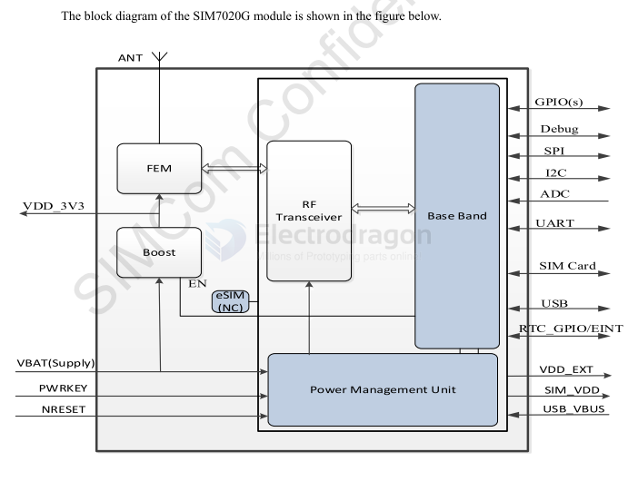
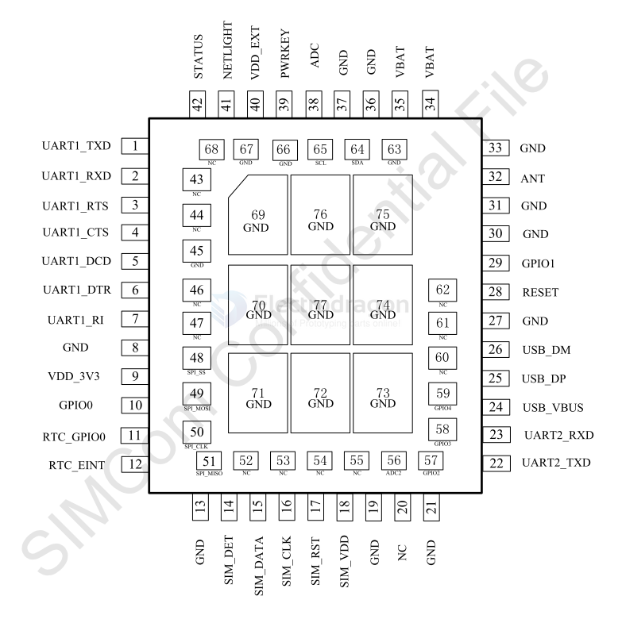

# SIM7020 DAT

https://www.electrodragon.com/product/sim7020e-4g-nbiot-mini-development-board/

- [[NBIOT-dat]] 

## SIM7020E VS SIM7020G

| bands | SIM7020G@Cat-M | SIM7020G@NBIOT | SIM7020E | SIM7020C |
|-------|----------------|----------------|----------|----------|
| B1    | ✔             | ✔             | ✔       | ✔       |
| B2    | ✔             | ✔             |          |          |
| B3    | ✔             | ✔             | ✔       | ✔       |
| B4    | ✔             | ✔             |          |          |
| B5    | ✔             | ✔             | ✔       | ✔       |
| B8    | ✔             | ✔             | ✔       | ✔       |
| B12   | ✔             | ✔             |          |          |
| B13   | ✔             | ✔             |          |          |
| B14   | ✔             | ?              |          |          |
| B17   | ?              | ?              |          |          |
| B18   | ✔             | ✔             |          |          |
| B19   | ✔             | ✔             |          |          |
| B20   | ✔             | ✔             | ✔       |          |
| B25   | ✔             | ✔             |          |          |
| B26   | ✔             | ✔             |          |          |
| B28   | ✔             | ✔             | ✔       |          |
| B66   | ✔             | ✔             |          |          |
| B70   | ?              | ?              |          |          |
| B71   | ?              | ✔             |          |          |
| B85   | ✔             | ✔             |          |          |
 
- [[bands-dat]]

## hardware diagram 

## Pin definitions 

## quick setup guide 

* Please use a USB-serial adapter like CP2102 or FT232RL, connect 5V, GND, VTXD and VRXD.
* Must well attached the SIM card and 2.4Ghz antenna.
* Hold down the side button for 3-5 seconds until LED start to blink,.
* Now you can send AT commands via serial uart COM port.
* (USB port is NOT working for debugging, please do not connect to use it.)

## Application Note 

## Power supply 

- VBAT  Module power voltage  min. 2.1  typ. 3.3  max. 3.6  V

### PSM Mode 

- AT commands to enter into PSM power save mode 
- pull down RTC_EINT or PWR_KEY to quit PSM mode 

- [[SIMCOM-PSM-Dat]]

## REF

### module versions 
module version: - SIM7020E tested working countries: Finland, Sweden

Supported band
- SIM7020E: B1 B3 B5 B8 B20 B28
- SIM7020G: all bands, please see our wiki page NBIOT.

- [[SIMCOM-AT-DAT]]

### other ref 
- NBIOT - https://w.electrodragon.com/w/Category:NBIOT
- legacy wiki - https://w.electrodragon.com/w/Category:SIM7020

- SIM7020 git info : https://github.com/Edragon/SIMCOM_SIM7020

## Demo 

- Basic Test Demo - https://www.youtube.com/shorts/HXGcgzOb-aY
- https://x.com/electro_phoenix/status/1640585737308622850

### board ref 

- [[NGS1095-dat]] - [[NGS1096-dat]] - [[NBIOT-dat]] - [[BTB-dat]]

- [[NGS1094-dat]] - SIM7020E (old version) - life time end 

- [[SIMCOM-AT-DAT]] - [[SIMCOM-dat]]

- [[low-power-dat]] - [[SIMCOM-PSM-Dat]]

- [[SIM7020]] 

## doc

- [[SIM7020_Series_AT_Command_Manual_V1.00.pdf]]

- [[SIM7020G_Hardware_Design_V1.00.pdf]]
