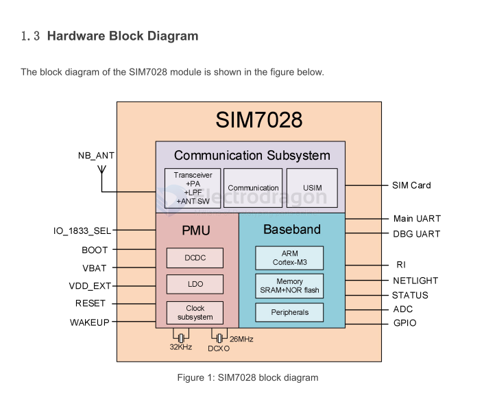
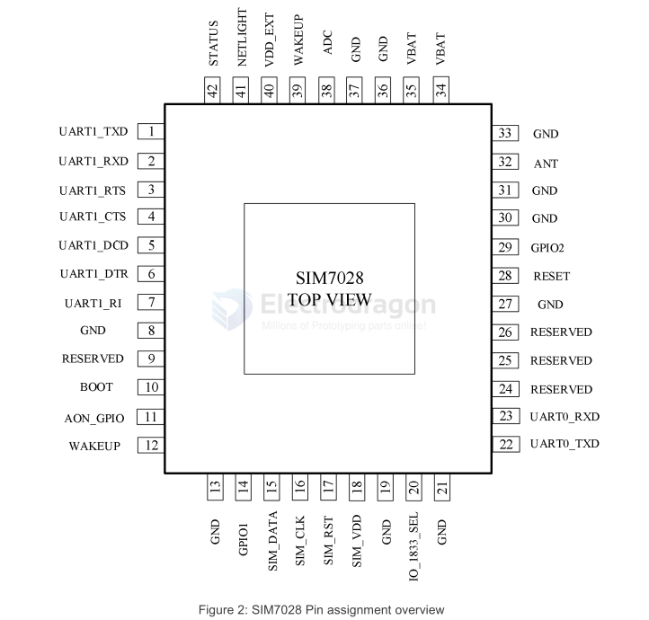
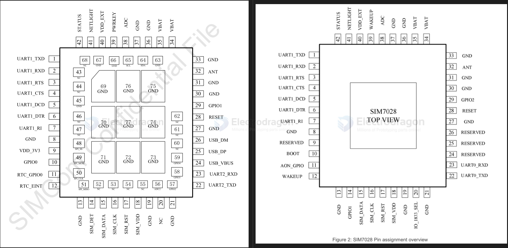

# SIM7028-dat

The SIM7028 module support LTE Category NB2, 2-HARQ. The physical dimension of SIM7028 is 17.6mm×15.7mm×2.3 mm. 

It is designed for applications that need low latency, Low throughput datacommunication in a variety of radio propagation conditions.

- [[bands-dat]] - [[SIMCOM-size-dat]]

## Diagram 

## Pin definitions 

### Comparison 

compare to [[SIM7020-dat]]
- no I2C, SPI
- USB in progress 
- extra IO_1833_sel

## ref 

- [[SIMCOM-dat]] - [[Cortex-M3-dat]]

- https://cn.simcom.com/product/SIM7028.html

