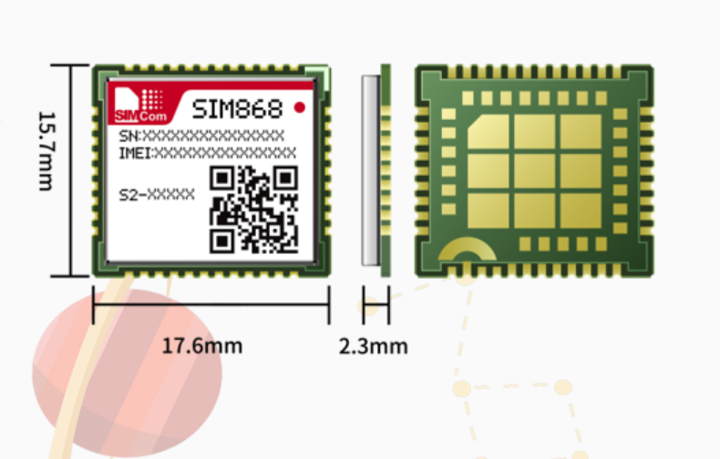
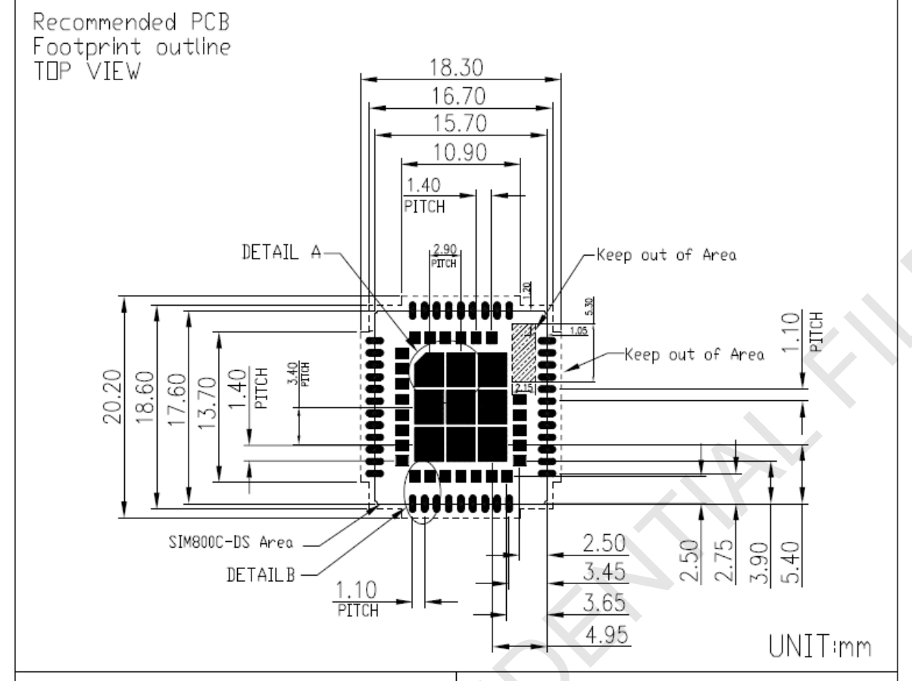
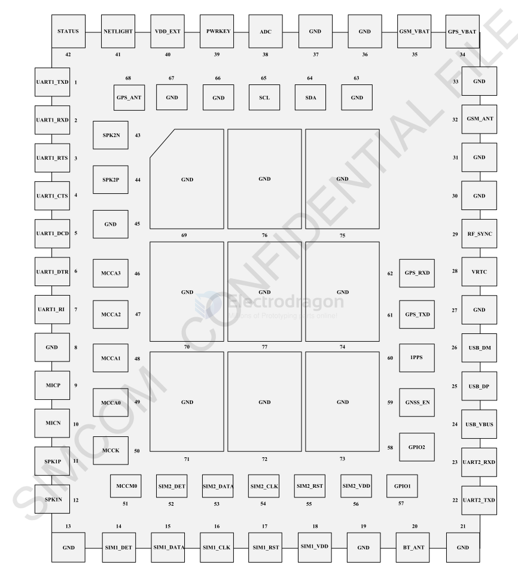

# SIM868-dat

- [[NGS1089-dat]] - [[SIM868-dat]] - [[SIMCOM-dat]] - [[location-dat]]

- [[SIMCOM-AT-DAT]] - [[SIMCOM-AT-location-DAT]] 

## Pin map 

## ref 

- [[SIM868]]

- [[SIMCOM-dat]]

- [[M2M]]